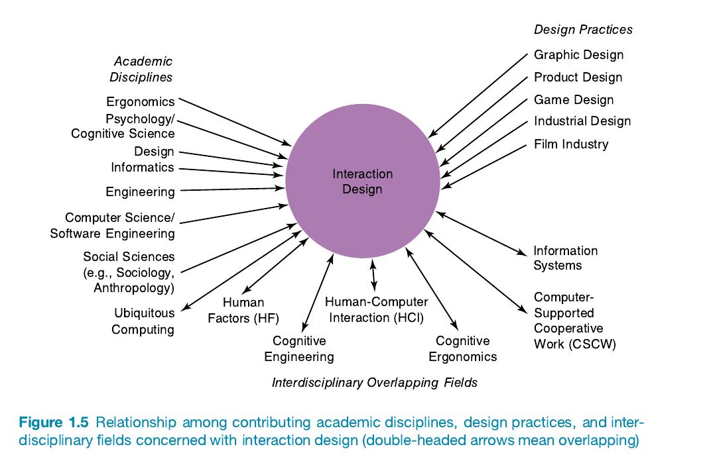

### Chapter 1: What is Interaction Design

#### 1.1 Introduction 📝
#### 1.2 Good and Poor Design 👍👎
#### 1.3 Switching to Digital 💻🔄
#### 1.4 What to Design 🎨
#### 1.5 What Is Interaction Design? 🤔✨
#### 1.6 People-Centered Design 👥❤️
#### 1.7 Understanding People 🧠👥
#### 1.8 Accessibility and Inclusiveness ♿🤲
#### 1.9 Usability and User Experience Goals 🎯😊

---
#### 1.1 Introduction 📝

**Definitions**:
- **Interaction Design (IxD)**: Designing interactive products that aim to make the user experience easy, effective, and enjoyable.
- **User Experience (UX) Design**: Focuses on optimizing the user’s overall experience while interacting with a product or service.
- **People-Centered Design**: Focuses on a broader approach that goes beyond individual users, addressing groups, societies, and their interactions with technology.
- **Customer Experience (CX)**: Covers the total experience a person has with a product, including brand engagement, and the likelihood to recommend it (Lowden, 2014).

**Key Attributions**:
- **Alan Cooper (2018)**: Criticized the failure of many modern products to apply basic interaction design principles, labeling it as "inexplicable and unforgivable."
- **Don Norman (2018)**: Advocated for shifting the language from "user" to "people" to emphasize broader impact.

**Key Lists**:
- **Usability Goals** (e.g., effectiveness, efficiency, safety, utility, learnability, memorability).
- **Design Principles** (e.g., visibility, feedback, constraints, consistency, affordance).

---

#### 1.2 Good and Poor Design 👍👎

**Concepts of Good and Poor Design**:
- **Good Design**: Interactive products that are easy, enjoyable, and efficient. For example, using a smartphone or tablet, where swiping through photos feels natural and satisfying.
- **Poor Design**: Products that are confusing or frustrating, often due to a lack of clear guidance or feedback. An example is setting the time on a stove, which can be unintuitive due to non-obvious button combinations.

**Alan Cooper’s Perspective**:
- **Alan Cooper (2018)**: Critiques the continued existence of poor design in software products, stating many still do not offer basic features like "undo." This suggests that even modern software lacks essential interaction design principles.

---

#### 1.3 Switching to Digital 💻🔄

**Considerations in Digital Transformation**:
- Focuses on the shift from physical artifacts to digital interactions.
- Raises questions about what is gained and what is lost during this transformation.
- Emphasizes the importance of carefully designing digital versions of activities that were traditionally done in a physical manner.

---

#### 1.4 What to Design 🎨

**Design Goals**:
- Products must be designed with users in mind to enhance ease of use and satisfaction.
- Need to identify real-world user requirements and use cases to guide effective design.
- Emphasis on understanding users’ mental models and designing accordingly.

---

#### 1.5 What Is Interaction Design? 🤔✨

**Interaction Design Overview**:
- **Interaction Design (IxD)**: Encompasses the design of how users interact with products.
- Uses various approaches, including user interface design, product design, and UX design.
- Aims to ensure products are useful, usable, and provide a delightful experience.

**Design Approaches Mentioned**:
- **User-Centered Design (UCD)**
- **Human-Centered Design (HCD)**
- **Interactive System Design**
  
IxD serves as an overarching term that includes many of these approaches.

---

#### 1.6 People-Centered Design 👥❤️

**Don Norman’s Proposal**:
- **Don Norman (2018)**: Advocates for the use of "people-centered design," which emphasizes designing with the broader implications for groups and societies in mind rather than focusing solely on individual users.

**Terminology Debate**:
- **User vs. People vs. Customer**: The choice of terminology should match the context:
  - **User** is appropriate for specific technological interactions.
  - **People** is broader, suitable for social or community impacts.
  - **Customer** encompasses the entire customer journey and overall experience.

---

#### 1.7 Understanding People 🧠👥

**Key Considerations**:
- Interaction design requires a deep understanding of people’s needs, abilities, and preferences.
- Focus on how individuals think, perceive, and use products.
- Understanding these aspects can help to design products that are intuitive and effective.

---

#### 1.8 Accessibility and Inclusiveness ♿🤲

**Key Principles**:
- Design should accommodate users with different abilities and backgrounds.
- **Accessibility**: Products should be usable by as many people as possible, including those with disabilities.
- **Inclusiveness**: Considering diverse user groups to ensure that products are beneficial to a wide range of people.
  
**Goals**:
- **Inclusiveness**: Design should ensure products are accessible to everyone, regardless of physical, sensory, or cognitive capabilities.

---

#### 1.9 Usability and User Experience Goals 🎯😊

**Usability Goals**:

- ✅ **Effectiveness**: The system should help users achieve their goals.
- ⏱️ **Efficiency**: Users should be able to accomplish tasks with minimal time and effort.
- 🛡️ **Safety**: Minimize risks and errors while ensuring that users can recover from mistakes.
- 🛠️ **Utility**: The product must have the right functionality to meet user needs.
- 📘 **Learnability**: Easy to learn how to use the product initially.
- 🔁 **Memorability**: Users should be able to remember how to use the product even after not using it for some time.

**User Experience (UX) Goals**:
- Focus on the overall **user satisfaction** and the **emotional** aspect of the interaction.
- Emphasis on **positive emotions** like enjoyment, pleasure, and satisfaction while avoiding negative experiences like frustration or confusion.

### Design Principles (to achieve Usability and UX goals):

- 🔍 **Visibility**: Users should easily understand what actions they can take.
- 🔔 **Feedback**: The system should give immediate responses to user actions.
- 🚧 **Constraints**: Limit user interactions to prevent errors.
- 🔄 **Consistency**: Ensures that similar actions have similar results across the system.
- 🖲️ **Affordance**: Elements should suggest their use (e.g., buttons look clickable).

---

### Summary

- 🤝 **Interaction design** is concerned with designing interactive products to support the way people communicate and interact in their everyday and working lives.
- 🌐 **Interaction design** is multidisciplinary, involving many inputs from wide-ranging disciplines and fields.
- 🔄 There is a growing shift toward replacing the term **user-centered design** with **people-centered design**.
- 🧠 Optimizing the **interaction between people and interactive products** requires consideration of a number of interdependent factors, including:
  - **Context of use** 🌍
  - **Types of activity** 🏃‍♀️📖
  - **Design goals** 🎯
  - **Accessibility** ♿
  - **Cultural differences** 🌎🌏
  - **User groups** 👥
- 🎯 Identifying and specifying relevant **usability and user experience goals** can help lead to the design of good interactive products.
- 📝 **Design principles**, such as **feedback** 🔔 and **simplicity** ✨, are useful heuristics for informing, analyzing, and evaluating aspects of an interactive product.
