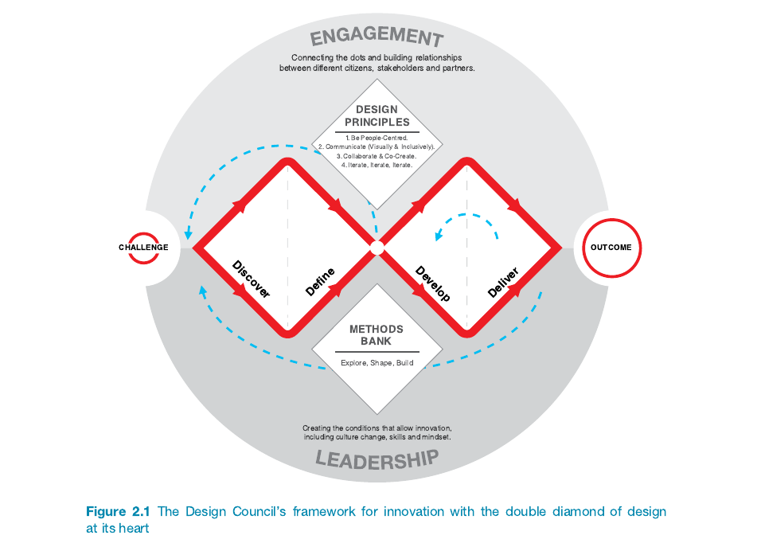
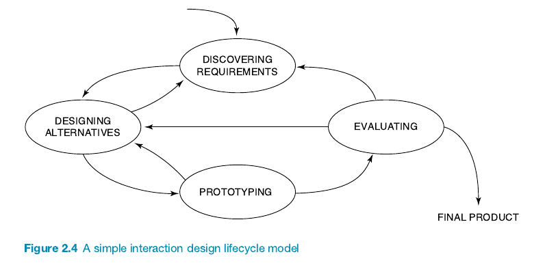
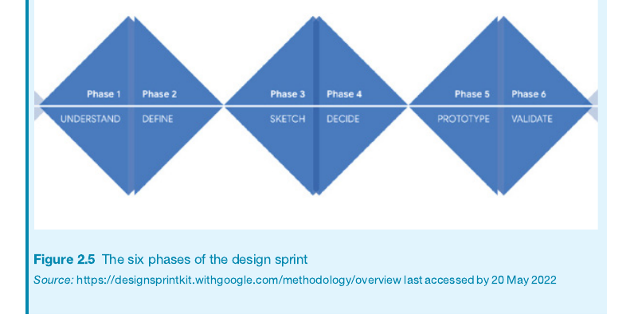
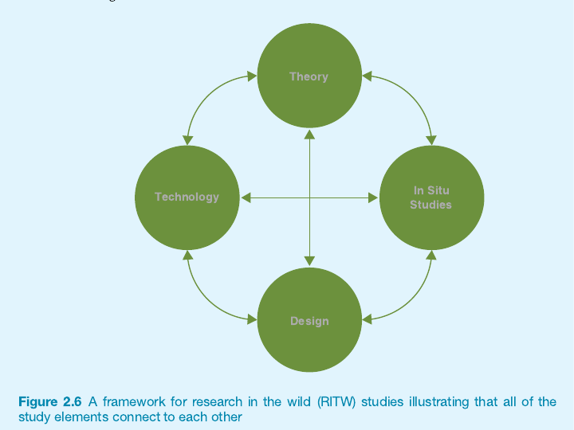

### Chapter 2: The Process of Interaction Design 🔄

**2.1 Introduction**
   
 **2.2 What Is Involved in Interaction Design?**
   - 2.2.1 Who to Involve in the Design Process
   - 2.2.2 The Importance of Involving Users
   - 2.2.3 Degrees of User Involvement
   - 2.2.4 What Is a People-Centered Approach?
   - 2.2.5 Four Basic Activities of Interaction Design
   - 2.2.6 A Simple Lifecycle Model for Interaction Design

**2.3 Some Practical Issues**
   - 2.3.1 How to Find Out What People Need
   - 2.3.2 How to Decide What to Design
   - 2.3.3 How to Generate Alternative Designs
   - 2.3.4 How to Choose Among Alternative Designs

---

#### 2.1 Introduction 📸

**Key Objectives**:
- Reflect on what interaction design involves.
- Explain some of the advantages of involving a range of people as participants in the interaction design process.
- Introduce the four basic activities of interaction design and how they are related in a simple lifecycle model.
- Consider some practical questions about the interaction design process and how it fits into other development lifecycles.

**Key Ideas**:
- **People-Centered Concerns**: The goal is to design systems that prioritize the needs and experiences of people rather than just technical aspects.
- **Stakeholders and Trade-Offs**: Successful interaction design includes balancing the input from stakeholders, addressing conflicting requirements, and making informed trade-offs.

**Key Questions Raised**:
- How do we understand the needs of stakeholders?
- How can we balance design trade-offs effectively, such as user freedom versus system guidance?
- How do we generate alternatives, and how do we choose the best one?

---

#### 2.2 What Is Involved in Interaction Design? 💡🖊️

**The Double Diamond of Design**: 
- The **Design Council** of the UK created the **Double Diamond Model**:
  - **Discover** 🔍: Understanding the problem space and talking to those affected.
  - **Define** 📑: Defining the challenge based on insights gained.
  - **Develop** 🔧: Creating and co-designing different responses, drawing on inspirations.
  - **Deliver** 📦: Testing solutions at a small scale, rejecting or evolving based on outcomes.

**Four Design Principles**:
1. **Be People-Centered** 👥
2. **Communicate (Visually & Inclusively)** 🗣️🎨
3. **Collaborate & Co-Create** 🤝✨
4. **Iterate, Iterate, Iterate** 🔄🔄🔄

**Key Insights**:
- **Non-Linear Process**: The double diamond model shows that interaction design is iterative, where phases are repeated multiple times.
- **People-Centered Design Philosophy**: Engaging different stakeholders enhances the design process, making it more inclusive and representative of real needs.

**Quotes & Attributions**:
- **Maarten Houben et al. (2020)**: Conducted workshops involving diverse stakeholders for designing an interactive sound cushion, emphasizing user and stakeholder input.
- **Design Council (2019)**: "No idea is ever ‘finished’ in an ever-changing and digital world."

### Four Approaches to Interaction Design by Dan Saffer (2010) 📚✨

1. **User-Centered Design (UCD)** 👥🎯
   - **Focus**: The **user knows best**. Designers translate users' needs and goals into a design solution.
   - **Role of User**: Users guide the design.
   - **Citation**: *(Dan Saffer, 2010)*

2. **Activity-Centered Design (ACD)** 🔄⚙️
   - **Focus**: Centered on the **behavior** surrounding tasks. The user’s behavior, not their goals, is key.
   - **Role of User**: Users are significant, but behavior is prioritized.
   - **Citation**: *(Dan Saffer, 2010)*

3. **Systems Design** 🌐🛠️
   - **Focus**: A **structured and holistic approach** that emphasizes the **system**—people, computers, objects, and devices.
   - **Role of User**: Users set the system’s goals, while the design focuses on how the entire system interacts.
   - **Citation**: *(Dan Saffer, 2010)*

4. **Genius Design** 🎨💡
   - **Focus**: Relies on the **designer’s creativity and experience**. Users do not participate in the design but help validate the outcomes.
   - **Term by Jim Leftwich**: Also known as "**Rapid Expert Design**" (Dan Saffer, 2010, pp. 44–45).
   - **Role of User**: Users validate the designer’s ideas.
   - **Citation**: *(Dan Saffer, 2010)*

**Key Insight**:
- Different design problems call for different approaches. Designers often gravitate towards the method that best suits them or the specific problem they are addressing.

#### 2.2.1 Who to Involve in the Design Process 🤝🔄

**Key Takeaways**:
- **Stakeholders Defined**: Stakeholders are individuals or groups that can influence or be influenced by the success or failure of a product. This includes **users, customers, developers, executives, regulators**, and **people affected by the product** (Freeman, 1984).

- **Identifying Stakeholders**: Stakeholder groups are broader than just users; they include everyone from customers who pay for the product to regulators who set rules for it. Questions like **"Who is interested in the project?"** and **"Who is affected by its introduction?"** help identify key stakeholders.

- **Example - Self-driving Delivery Trucks** 🚚🤖: 
  - **Primary Stakeholders**: Truck drivers, their families, developers of software and hardware, and the companies that use these trucks. Each group has different stakes, ranging from **job safety** to **successful delivery**.
  - **Indirect Stakeholders**: Government regulators, pedestrians, other vehicle manufacturers, and individuals interested in carbon emissions reduction.

- **Challenges in Engagement**: Not all stakeholders need to be actively involved, but knowing who they are helps in determining the level of involvement. Identifying diverse stakeholders, like in the case of **smartphone users** who fit 382 different user types (Sha Zhao et al., 2016), is more complex than it seems.

- **Practical Difficulties**:
  - Engaging stakeholders can be challenging, especially in large projects. For instance, **Seaborn et al. (2020)** found it difficult to involve residents in an urban food waste project despite trying several strategies, ultimately opting to **observe existing waste habits** as an engagement method.

**Summary**:
Stakeholder analysis is critical in interaction design as it helps determine who has a stake in the product's success. Stakeholders can range from **direct users** to those affected by a product indirectly, and their involvement should be planned carefully. However, engaging these stakeholders can be challenging, especially when trying to reach diverse user types or a wider community.

#### 2.2.2 The Importance of Involving Users 🧑‍🤝‍🧑💡

- **User Involvement**: Involving users during all stages of product development ensures that the final product is usable and meets user needs effectively.
- **Role of Product Owner**: The product owner helps filter user input, but involving users directly gives a more comprehensive understanding.
- **Expectation Management**: Including users early on helps manage expectations, reducing resistance or rejection by giving them realistic previews of the product.
- **Sense of Ownership**: Early user involvement fosters a sense of ownership, increasing acceptance and support for the product.
- **Optimal Involvement**: User involvement is beneficial, but it needs to be planned carefully regarding when, how, and in what capacity users should contribute.

#### 2.2.3 Degree of User Involvement 🔄👥

- **Various Degrees**: User involvement can vary from full-time engagement throughout the development to targeted, specific contributions. Involvement can be small-scale (face-to-face) or large-scale (online crowdsourcing).
- **Participation Methods**: Techniques like crowdsourcing and citizen engagement enable many people to contribute to product development, enhancing design quality, satisfaction, and a sense of ownership.
- **Participatory Design**: Users and stakeholders are central participants in the design process rather than passive receivers, often referred to as co-design or co-creative design.
- **Practical Considerations**: The degree of user involvement depends on project circumstances, such as whether the product is for a specific company or the open market.
- **Feedback After Release**: After a product is released, ongoing user feedback can be gathered through customer reviews, data analysis, and error reporting systems, which is valuable for continuous improvement.

#### 2.2.4 What Is a People-Centered Approach? 👥🌍

- **Foundational Principles (Gould & Lewis, 1985)**:
  1. **Early Focus on Users and Tasks**: Understand users by studying their characteristics and observing them during tasks.
  2. **Empirical Measurement**: Observe and measure user reactions to prototypes and designs.
  3. **Iterative Design**: Address problems identified during user testing through repeated design, testing, and improvements.

- **Extended People-Centered Principles**:
  - **User Tasks Drive Development**: Technology is secondary to supporting user goals.
  - **Understand Behavior & Context**: Design systems based on how people perform tasks.
  - **Accommodate User Characteristics**: Account for cognitive and physical limitations (e.g., color blindness).
  - **Ongoing User Consultation**: Involve users throughout the entire development process.
  - **Contextual Design Decisions**: Make design choices with users' activities and environments in mind.

- **Additional Design Elements**:
  - **Clear Usability Goals**: Document and agree on specific goals to guide evaluation.
  - **Iteration**: Design evolves through continuous feedback, reflecting the need for repeated refinement.

#### 2.2.5 Four Basic Activities of Interaction Design 🔄✨

1. **Discovering Requirements**: Understand the needs of target users through data gathering and analysis, forming the basis for product requirements.

2. **Designing Alternatives**: Create multiple design ideas, including conceptual (high-level functionality) and concrete (specific details like color and layout) designs to meet identified requirements.

3. **Prototyping**: Build prototypes to represent different aspects of the design for user interaction. Prototypes can be physical, paper-based, or digital to help users experience and evaluate the product.

4. **Evaluating**: Assess usability and user experience through testing, ensuring the product is both functional and meets user expectations. This evaluation helps refine designs and inform future iterations.

These activities are interconnected and iterative, continuously refining the design through feedback.

#### 2.2.6 A Simple Lifecycle Model for Interaction Design

**Lifecycle Models**:
- **A Simple Lifecycle Model** 🚀:
  - **Discovering Requirements**: Understanding the target users and identifying how the product can be useful.
  - **Designing Alternatives**: Conceptual and concrete design steps to generate multiple alternatives.
  - **Prototyping**: Creating prototypes for usability testing.
  - **Evaluating**: Assessing prototypes to refine the final product.

#### Design Sprint Phases 🏃‍♂️💨

- **Pre-sprint (Planning) 📝**: Write a brief, choose the challenge, assemble the team, and set up time & space.
- **Phase 1 (Understand) 🧠**: Articulate the problem space with input from experts.
- **Phase 2 (Define) 🎯**: Focus on what you learned to identify the sprint's main goal.
- **Phase 3 (Sketch) ✏️**: Generate ideas and sketch solutions; each team member develops one.
- **Phase 4 (Decide) ✅**: Pick the best idea to move forward.
- **Phase 5 (Prototype) 🛠️**: Build a simple prototype to test your idea.
- **Phase 6 (Validate) 📊**: Gather user feedback and validate (or invalidate) the solution.

#### Research in the Wild (RITW) 🌳🔍

**What is RITW?**:
- **Developing Tech in Real Life** 🛠️🌍: RITW develops tech solutions by creating and testing them in everyday settings. Researchers experiment with new tech possibilities that can change behaviors.

Developed by **Rogers and Marshall (2017)**: 

**Key Elements of RITW**:

- **Technology** 💻🔌: Use or adapt existing devices like **IoT toolkits** or develop new ones (e.g., a **public display**).
- **Design** 🎨🔄: Design interactive experiences, like **travel planning tools** or an **AR game**.
- **In Situ Study** 🏠🧪: Test tools or prototypes in real-life settings (e.g., someone's home) to see how they are used over time.
- **Theory** 📚💡: Investigate ideas about **behavior**, **settings**, or **phenomena**—either existing or new.

**Goal**:
- **Challenge Assumptions** 🤔⚡: Observe how people react to and integrate tech in their lives, challenging assumptions about human behavior and informing new HCI theories.

---

#### 2.3 Some Practical Issues 🔍⚙️

##### 2.3.1 How to Find Out What People Need 🤔✨

- **Unspoken Needs**: People often cannot articulate what they need as they might not be aware of possibilities ("un-dreamed-of" needs).
- **Explore the Problem Space**:
  - Investigate users, their context, and activities.
  - Identify areas for improvement rather than asking users directly.
- **Mixed Approach**:
  - Combine exploration, testing ideas, and gathering feedback to decide what to build.
- **User Feedback**:
  - Use **rapid design sprints** and **in-the-wild studies** to gather authentic feedback early on.
  - These methods can provide surprising and valuable insights into real user needs.
- **Focus on Goals**:
  - Prioritize **user goals**, **usability goals**, and **user experience goals** rather than relying solely on user-stated requirements. 
- **Real-World Example**:
  - IDEO, a design company, uses community engagement and explores human needs to innovate and create impactful designs.

##### 2.3.2 How to Decide What to Design 🎯🛠️

- **Explore the Problem Space**:
  - Understanding the problem space is crucial before jumping into designing solutions.
  - Avoid starting with the physical interface or specific technologies too early.
  - Misunderstanding user needs, context, or missing usability goals can occur when diving into technical design without proper exploration.

- **Importance of User Context**:
  - Understand **current user experiences**, identify why changes are needed, and determine how these changes will improve user experience.
  - Example: Augmented reality navigation systems have evolved from years of research into usability and safety for drivers.

- **Team Effort**:
  - Defining the problem space should be a **collaborative process**.
  - Different team members (e.g., project managers vs. software engineers) will have unique perspectives—considering all perspectives is important to avoid incorrect assumptions.

- **Benefits of Thorough Exploration**:
  - Prevents incorrect assumptions that could lead to an unusable or unwanted design.
  - Encourages more options and possibilities to be considered.
  - Results in a solution that is well-supported by an understanding of both user needs and the business case.

- **Justification of Design Choices**:
  - Designers need to be able to clearly explain and justify their design choices.
  - Articulating the rationale in both **business** and **design terms** is increasingly valued in design fields.
  

##### 2.3.3 How to Generate Alternative Designs 💡✨

- **Avoid Settling for "Good Enough"**:
  - Relying on an initial solution may prevent discovering better alternatives.
  - Exploring different solutions is essential for good design.

- **Sources of Alternative Ideas**:
  - **Individual Creativity**: Some designers generate inspired designs based on personal creativity.
  - **Cross-Fertilization**: Sharing ideas in multidisciplinary teams or stakeholder workshops helps generate new designs.
  - **Evolution of Products**: Improvements come through observation and cross-domain influences (e.g., from cell phones to smartphones).

- **Techniques for Generating Ideas**:
  - **Creativity Prompts**: Browsing collections of designs or using prompts like **SCAMPER** can inspire fresh ideas.
  - **Creativity Cards**: Various ideation cards exist to prompt new ideas and can be useful for co-design workshops.

- **The Value of Diverse Perspectives**:
  - Different sources of inspiration (competitors’ products, existing systems, unrelated domains) can provide valuable insights.
  - Considering different perspectives enriches the design process and can lead to more creative outcomes.

- **Constraints in Alternative Design**:
  - Sometimes constraints limit available alternatives (e.g., adhering to a brand's look and feel).
  - Design decisions often need to balance keeping familiar elements versus exploring new conceptual models.

- **Legal Considerations**:
  - **Copyright and Patent Laws**:
    - Ideas are not copyrighted, but their **expression** is.
    - **Patents** protect the idea itself, e.g., Amazon’s one-click purchase.
  - **Creative Commons and Open Source**: Offer more flexible use of designs, supporting collaboration without infringing on copyrights or patents.

- **Dilemma of Copying for Inspiration**:
  - Designers need to understand the legal boundaries of using others' work for inspiration.
  - Creative commons and open-source communities help facilitate legal, collaborative use of designs.
  - 
##### 2.3.4 How to Choose Among Alternative Designs

#### 2.3.5 How to integrate interaction design activities with other lifecycle models

---

**Key Practical Issues to Address**:
- **How to find out what people need** 🗣️: Asking people may not always provide accurate insights since they may not know what is possible or needed.
- **Generating Alternative Designs** 💡: Using prompts and other creativity tools can help inspire designers to come up with alternatives.
- **Choosing Among Alternatives** 🔀: Making informed design decisions is crucial; each decision can impact the final product experience.

**User Involvement**:
- **Degrees of User Involvement** 👥: User involvement can range from fully engaged throughout all iterations to targeted participation in specific activities. Full-time involvement can yield deeper insights but risks detachment from the community.
- **People-Centered Approach** 🌍: Building on the early principles by **John Gould and Clayton Lewis (1985)**, user-centered design has evolved to involve more stakeholders throughout the entire process.

---

**Key Attributions**:
- **Uli Abelein et al. (2013)**: Found that user involvement generally has a positive effect on user satisfaction and system use, though results vary based on involvement levels.
- **Suzanne and James Robertson (2013)**: Coined the term **“un-dreamed-of needs”**, highlighting that people may not always be aware of their own future needs.

---

### Summary

- 🎨 **Different design disciplines** follow different approaches, but they have commonalities that are captured in the **double diamond of design**.
- 🧠 **Understand the Problem Space**: It is important to have a good understanding of the problem space before trying to build anything.
- 🔄 The **interaction design process** consists of four basic activities: **discovering requirements** 🕵️‍♂️, **designing alternatives** ✏️, **prototyping** 🛠️, and **evaluating** 📊.
- 👥 **People-centered design** rests on three principles: **early focus on users and tasks** ⏱️, **empirical measurement** 📏, and **iterative design** 🔁. These principles are key for interaction design.
- 🤝 **Involving users and stakeholders** assists with **expectation management** 🎯 and **feelings of ownership** 🏠, but careful planning is needed for how and when to involve them.
- 🔍 Looking at **others’ designs** and **involving others** in the design process provides useful **inspiration** 💡 and encourages considering **alternative solutions** ✨, which is key to effective design.
- ⚖️ **Usability criteria**, **technical feasibility** ⚙️, and **user feedback** 💬 can all be used to **choose among alternatives**.
- 🛠️ **Prototyping** is a useful technique for **facilitating user feedback** on designs at all stages.
- 🔄 **Interaction design activities** are becoming better integrated with **lifecycle models** from other related disciplines like **software engineering** 💻.

