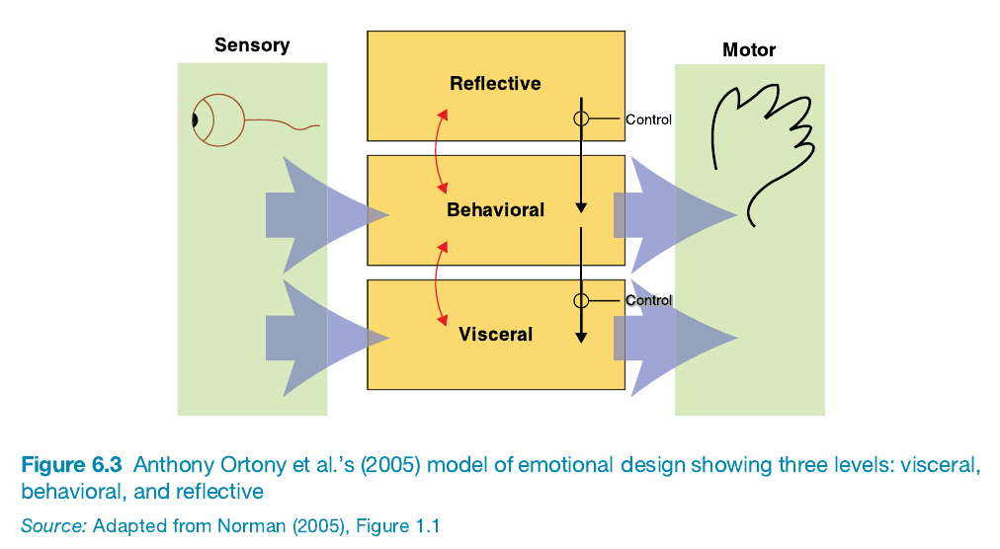

## Chapter 6: Emotional Interaction

6.1 Introduction

6.2 Emotions and Behavior  
- 6.2.1 Everyday Activities and Emotional Responses  
- 6.2.2 Understanding Emotional States  
- 6.2.3 How Emotions Affect Behavior  
- 6.2.4 Activity 6.1: Reflecting on Emotions  
- 6.2.5 Emotional Triggers and their Consequences  
- 6.2.6 Automatic and Conscious Emotions  
- 6.2.7 Box 6.1: How Does Emotion Affect Driving Behavior?

6.3 Expressive Interfaces: Aesthetic or Annoying?  
- 6.3.1 Features of Expressive Interfaces  
- 6.3.2 Examples of Expressive Interfaces in Retail  
- 6.3.3 Annoying Interfaces: The Case of Clippy and Virtual Agents  
- 6.3.4 Aesthetics and Usability: The Positive Effect of Design  
- 6.3.5 Activity 6.3: Reimagining the "404 Error" Message  
- 6.3.6 Dilemma: Should Voice Assistants Teach Kids Good Manners?

6.4 Affective Computing and Emotional AI  
- 6.4.1 Measuring and Tracking Affect and Emotions  
  - 6.4.1.1 Techniques for Emotion Sensing  
  - 6.4.1.2 Facial Coding and Affectiva Software  
  - 6.4.1.3 Box 6.2: ASMR and Food Videos  
- 6.4.2 Tracking and Reflecting on Moods  
  - 6.4.2.1 Mood Tracker Apps  
  - 6.4.2.2 Virtual Reality and Mood Exploration  
  - 6.4.2.3 Box 6.3: Ethical Concerns of Emotional Tracking

6.5 Persuasive Technologies and Behavioral Change  
- 6.5.1 Types of Persuasive Technologies  
- 6.5.2 Positive Reinforcement in Devices  
- 6.5.3 Nudging Behavior Towards Sustainability  
  - 6.5.3.1 Box 6.4: Using Social Norms for Energy Reduction  
- 6.5.4 Tidy Street Experiment: Public Energy Visualization  
- 6.5.5 Activity 6.4: Fun Theory and Behavior Change

6.6 Anthropomorphism  
- 6.6.1 Designing Human-Like Qualities in Objects  
- 6.6.2 Social Robots in Caregiving  
- 6.6.3 Activity 6.5: Evaluating Soft vs. Hard Robot Pets  
- 6.6.4 Box 6.5: Example of Stevie, the Social Robot  

---
### **6.1 Introduction Summary**:

**Key Concepts**:
- **Emotional AI & Affective Computing** 🤖❤️: Technology that detects and recognizes emotions through facial expressions, body movements, and gestures. Applications are widespread—ranging from health to retail, driving, and education.
- **Wearable Mood Sensors** ⌚️📊: Hypothetical devices that monitor emotional states and suggest actions to improve mood, sparking discussions about the usefulness versus the potential intrusion of such technologies.
- **Emotional Design** 🎨✨: Designing interactive products to evoke specific emotional responses, such as apps that help users reflect on emotions or social robots to combat loneliness.
- **Desired Emotional States** 🧠🌈: The aim is to design for positive emotional experiences, which can make users feel happy, attached, or motivated.
- **Expressive & Persuasive Interfaces** 🎭💬: Interfaces that influence emotions or behavior—using visual, auditory, or interactive elements.
- **Anthropomorphism in Interaction Design** 🐶🤖: Assigning human-like qualities to objects or interfaces (e.g., virtual pets and social robots) to enhance user engagement.

**Quotes & Attributions**:
- **Rosalind Picard (1997)**: Coined the term "affective computing" to describe technologies that can measure and simulate emotions, aiming to improve user interactions.
- **Don Norman (2005)**: Explores "emotional design" and highlights that well-designed products can evoke pleasure and attachment, influencing user experience.
  
### **6.2 Emotions and Behavior**:

**Key Concepts**:
- **Emotional Rollercoaster of Online Shopping** 🎢🛍️: Emotions like desire, anticipation, joy, frustration, and doubt are experienced in different phases of shopping online, especially with complex decisions involving multiple options.
- **Physical Expression of Emotions** 😊😠: Tools like **Happyornot** terminals let users physically express emotions, collecting valuable data for services (e.g., airport experience feedback).
- **Dynamic Nature of Emotions** 🌧️🌤️: Emotions can vary dramatically, shifting quickly (e.g., startled by a noise) or lingering longer (e.g., annoyance from an external disturbance).
- **Automatic vs. Conscious Emotions** ⚡🧠: Emotions can be **automatic** (like instant fear) or **conscious** (involving reflection), each impacting behavior differently.
- **Impact of Emotions on Behavior** 🧭: The connection between emotion and behavior can be complicated—sometimes positive emotions boost creativity, while negative emotions might sharpen focus.
- **Ortony, Norman, and Revelle Model (NB!!!)** 🎮🧠: Describes three brain levels—**Visceral** (automatic reactions), **Behavioral** (everyday routines), and **Reflective** (deep thought)—to inform product design that triggers different levels of emotional response.
- **Plutchik’s Wheel of Emotions** 🎨🌈: This visual tool categorizes emotions and helps designers consider different emotional states for user experiences, like designing emotional elements in video games.

**Quotes & Attributions**:
- **Roy Baumeister et al. (2007)**: Suggested that the link between emotions and behaviors is complex and context-dependent rather than straightforward.
- **Mayer Tamir & Yochanan Bigman (2017)**: Found that emotions like excitement or calmness affect creativity depending on what participants are told about those emotional states.
- **Don Norman (2005)**: Proposed that being in a good mood can make people more tolerant of minor usability issues, while stressful situations require careful interface design.
- **Anthony Ortony, Don Norman, & William Revelle (2005)**: Developed a model explaining emotions and behavior in terms of different brain levels—**visceral**, **behavioral**, and **reflective**.

### **Ortony, Norman, and Revelle Model of Emotional Design** 🎮🧠

The ONR model categorizes emotions into three levels of brain functioning, helping designers understand how to trigger different emotional responses in users. Each level reflects a different way the brain processes emotions and reactions, which can be used to inform product and interaction design.

#### **1. Visceral Level** 🧬⚡
- **Definition**: The **visceral level** represents automatic, instinctual responses that are prewired into the brain. This level focuses on rapid, almost subconscious reactions to sensory stimuli—think of it as the "gut reaction."
- **Characteristics**:
  - **Immediate Responses**: The visceral level involves very fast, reflex-like reactions to the environment.
  - **Emotional Judgments**: These reactions often classify things as safe or dangerous, pleasurable or unpleasant.
  - **Aesthetics and Appeal**: When designing for the visceral level, the goal is often to make products visually and sensorially pleasing. This might include creating products that look attractive, feel comfortable, or sound pleasant.
- **Example**:
  - Seeing a **very large hairy spider** suddenly: Many people will experience fear immediately, scream, and possibly flee—this is an automatic visceral response.
  - **Design Application**: If a product looks sleek, has aesthetically pleasing colors, or produces a calming sound, it appeals to the visceral level by creating an immediate positive impression.

#### **2. Behavioral Level** 🚴‍♂️🛠️
- **Definition**: The **behavioral level** deals with the part of the brain responsible for everyday, routine actions. It concerns how well a product functions and the ease with which people can use it.
- **Characteristics**:
  - **Focus on Functionality**: It addresses usability—how simple and efficient the product is to use.
  - **Interaction and Control**: This level involves repeated and learned actions. It reflects the habits we form when interacting with products.
  - **Emotional Feedback**: Positive experiences at this level often lead to satisfaction and comfort, as people can easily accomplish their tasks.
- **Example**:
  - **Typing or Swimming**: These activities, once learned, become almost automatic. They involve learned skills that are controlled at the behavioral level.
  - **Design Application**: The **Swatch watch** uses intuitive controls and comfortable materials, making the day-to-day use of the watch enjoyable. A product that is straightforward, reliable, and allows users to perform their tasks without unnecessary difficulty is well-designed at this level.

#### **3. Reflective Level** 🧠💡
- **Definition**: The **reflective level** represents conscious thought, contemplation, and the meaning we attribute to products. It’s about what the product represents, how it aligns with our values, and how it makes us feel about ourselves.
- **Characteristics**:
  - **Intellectual and Symbolic Connections**: It’s more about personal significance, meaning, and the value the user places on the product in their life.
  - **Emotional Reflection**: Reflective design involves aspects like pride in ownership, nostalgia, or cultural resonance.
  - **Status and Identity**: This level reflects how a product might symbolize something to its user—such as status, fashion, or personal values.
- **Example**:
  - **Reflecting on a Horror Movie**: During a horror film, you may consciously think about the story’s narrative structure and artistic direction, even though the visceral level has you feeling fear during a jump scare.
  - **Design Application**: A **Swatch watch** might appeal to someone’s sense of personal identity or style, conveying a sense of fashion consciousness. The reflective level is engaged when the user thinks, "This watch expresses who I am."

### **Key Takeaways for Design** 🎨🛠️🧠
- **Layered Emotional Engagement**: Effective design aims to engage all three levels to create a rich, multi-dimensional user experience. A product should:
  1. **Viscerally** attract users with appealing looks and sensory qualities.
  2. **Behaviorally** satisfy them by being intuitive and easy to use.
  3. **Reflectively** resonate with their identity and personal values.
  
- **Practical Example—Smartphone Design** 📱:
  - **Visceral Level**: Smooth and shiny body, sleek design, bright colors, and satisfying tactile buttons.
  - **Behavioral Level**: Easy to navigate user interface, responsive screen, and ergonomic design for comfortable use.
  - **Reflective Level**: Users may feel pride in owning the latest model, or a sense of belonging to a particular community (e.g., being part of the "Apple" community).

### **Quotes & Attributions**:
- **Anthony Ortony, Don Norman, & William Revelle (2005)**: The ONR model of emotional design explains emotional responses through three levels—**visceral**, **behavioral**, and **reflective**—each engaging a different part of the user’s brain.

This model provides a useful framework for thinking about **designing interactive products that cater to different aspects of the user experience**. It helps designers aim for a balance where a product is **immediately appealing**, **functionally efficient**, and **meaningful** in a personal context. 😊🎨✨
