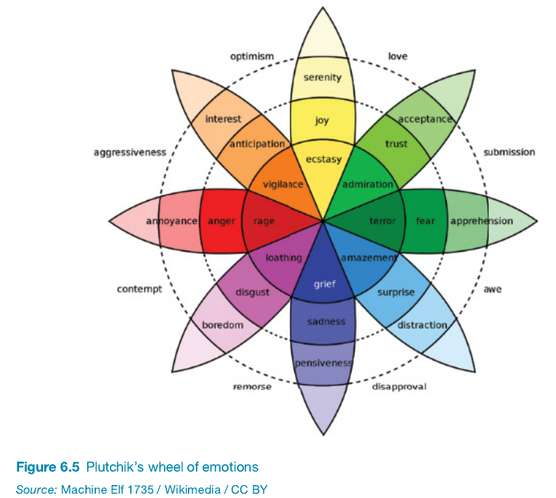

## Chapter 6: Emotional Interaction

6.1 Introduction  
6.2 Emotions and Behavior  
6.3 Expressive Interfaces: Aesthetic or Annoying?  
6.4 Affective Computing and Emotional AI  
6.5 Persuasive Technologies and Behavioral Change  
6.6 Anthropomorphism    

---
### **6.1 Introduction Summary**:

**Key Concepts**:
- **Emotional AI & Affective Computing** 🤖❤️: Technology that detects and recognizes emotions through facial expressions, body movements, and gestures. Applications are widespread—ranging from health to retail, driving, and education.
- **Wearable Mood Sensors** ⌚️📊: Hypothetical devices that monitor emotional states and suggest actions to improve mood, sparking discussions about the usefulness versus the potential intrusion of such technologies.
- **Emotional Design** 🎨✨: Designing interactive products to evoke specific emotional responses, such as apps that help users reflect on emotions or social robots to combat loneliness.
- **Desired Emotional States** 🧠🌈: The aim is to design for positive emotional experiences, which can make users feel happy, attached, or motivated.
- **Expressive & Persuasive Interfaces** 🎭💬: Interfaces that influence emotions or behavior—using visual, auditory, or interactive elements.
- **Anthropomorphism in Interaction Design** 🐶🤖: Assigning human-like qualities to objects or interfaces (e.g., virtual pets and social robots) to enhance user engagement.

**Quotes & Attributions**:
- **Rosalind Picard (1997)**: Coined the term "affective computing" to describe technologies that can measure and simulate emotions, aiming to improve user interactions.
- **Don Norman (2005)**: Explores "emotional design" and highlights that well-designed products can evoke pleasure and attachment, influencing user experience.
  
### **6.2 Emotions and Behavior**:

**Key Concepts**:
- **Emotional Rollercoaster of Online Shopping** 🎢🛍️: Emotions like desire, anticipation, joy, frustration, and doubt are experienced in different phases of shopping online, especially with complex decisions involving multiple options.
- **Physical Expression of Emotions** 😊😠: Tools like **Happyornot** terminals let users physically express emotions, collecting valuable data for services (e.g., airport experience feedback).
- **Dynamic Nature of Emotions** 🌧️🌤️: Emotions can vary dramatically, shifting quickly (e.g., startled by a noise) or lingering longer (e.g., annoyance from an external disturbance).
- **Automatic vs. Conscious Emotions** ⚡🧠: Emotions can be **automatic** (like instant fear) or **conscious** (involving reflection), each impacting behavior differently.
- **Impact of Emotions on Behavior** 🧭: The connection between emotion and behavior can be complicated—sometimes positive emotions boost creativity, while negative emotions might sharpen focus.
- **Ortony, Norman, and Revelle Model (NB!!!)** 🎮🧠: Describes three brain levels—**Visceral** (automatic reactions), **Behavioral** (everyday routines), and **Reflective** (deep thought)—to inform product design that triggers different levels of emotional response.
- **Plutchik’s Wheel of Emotions** 🎨🌈: This visual tool categorizes emotions and helps designers consider different emotional states for user experiences, like designing emotional elements in video games.

**Quotes & Attributions**:
- **Roy Baumeister et al. (2007)**: Suggested that the link between emotions and behaviors is complex and context-dependent rather than straightforward.
- **Mayer Tamir & Yochanan Bigman (2017)**: Found that emotions like excitement or calmness affect creativity depending on what participants are told about those emotional states.
- **Don Norman (2005)**: Proposed that being in a good mood can make people more tolerant of minor usability issues, while stressful situations require careful interface design.
- **Anthony Ortony, Don Norman, & William Revelle (2005)**: Developed a model explaining emotions and behavior in terms of different brain levels—**visceral**, **behavioral**, and **reflective**.

---

### **Ortony, Norman, and Revelle Model of Emotional Design** 🎮🧠

The ONR model categorizes emotions into three levels of brain functioning, helping designers understand how to trigger different emotional responses in users. Each level reflects a different way the brain processes emotions and reactions, which can be used to inform product and interaction design.

#### **1. Visceral Level** 🧬⚡
- **Definition**: The **visceral level** represents automatic, instinctual responses that are prewired into the brain. This level focuses on rapid, almost subconscious reactions to sensory stimuli—think of it as the "gut reaction."
- **Characteristics**:
  - **Immediate Responses**: The visceral level involves very fast, reflex-like reactions to the environment.
  - **Emotional Judgments**: These reactions often classify things as safe or dangerous, pleasurable or unpleasant.
  - **Aesthetics and Appeal**: When designing for the visceral level, the goal is often to make products visually and sensorially pleasing. This might include creating products that look attractive, feel comfortable, or sound pleasant.
- **Example**:
  - Seeing a **very large hairy spider** suddenly: Many people will experience fear immediately, scream, and possibly flee—this is an automatic visceral response.
  - **Design Application**: If a product looks sleek, has aesthetically pleasing colors, or produces a calming sound, it appeals to the visceral level by creating an immediate positive impression.

#### **2. Behavioral Level** 🚴‍♂️🛠️
- **Definition**: The **behavioral level** deals with the part of the brain responsible for everyday, routine actions. It concerns how well a product functions and the ease with which people can use it.
- **Characteristics**:
  - **Focus on Functionality**: It addresses usability—how simple and efficient the product is to use.
  - **Interaction and Control**: This level involves repeated and learned actions. It reflects the habits we form when interacting with products.
  - **Emotional Feedback**: Positive experiences at this level often lead to satisfaction and comfort, as people can easily accomplish their tasks.
- **Example**:
  - **Typing or Swimming**: These activities, once learned, become almost automatic. They involve learned skills that are controlled at the behavioral level.
  - **Design Application**: The **Swatch watch** uses intuitive controls and comfortable materials, making the day-to-day use of the watch enjoyable. A product that is straightforward, reliable, and allows users to perform their tasks without unnecessary difficulty is well-designed at this level.

#### **3. Reflective Level** 🧠💡
- **Definition**: The **reflective level** represents conscious thought, contemplation, and the meaning we attribute to products. It’s about what the product represents, how it aligns with our values, and how it makes us feel about ourselves.
- **Characteristics**:
  - **Intellectual and Symbolic Connections**: It’s more about personal significance, meaning, and the value the user places on the product in their life.
  - **Emotional Reflection**: Reflective design involves aspects like pride in ownership, nostalgia, or cultural resonance.
  - **Status and Identity**: This level reflects how a product might symbolize something to its user—such as status, fashion, or personal values.
- **Example**:
  - **Reflecting on a Horror Movie**: During a horror film, you may consciously think about the story’s narrative structure and artistic direction, even though the visceral level has you feeling fear during a jump scare.
  - **Design Application**: A **Swatch watch** might appeal to someone’s sense of personal identity or style, conveying a sense of fashion consciousness. The reflective level is engaged when the user thinks, "This watch expresses who I am."

### **Key Takeaways for Design** 🎨🛠️🧠
- **Layered Emotional Engagement**: Effective design aims to engage all three levels to create a rich, multi-dimensional user experience. A product should:
  1. **Viscerally** attract users with appealing looks and sensory qualities.
  2. **Behaviorally** satisfy them by being intuitive and easy to use.
  3. **Reflectively** resonate with their identity and personal values.
  
- **Practical Example—Smartphone Design** 📱:
  - **Visceral Level**: Smooth and shiny body, sleek design, bright colors, and satisfying tactile buttons.
  - **Behavioral Level**: Easy to navigate user interface, responsive screen, and ergonomic design for comfortable use.
  - **Reflective Level**: Users may feel pride in owning the latest model, or a sense of belonging to a particular community (e.g., being part of the "Apple" community).

### **Quotes & Attributions**:
- **Anthony Ortony, Don Norman, & William Revelle (2005)**: The ONR model of emotional design explains emotional responses through three levels—**visceral**, **behavioral**, and **reflective**—each engaging a different part of the user’s brain.

This model provides a useful framework for thinking about **designing interactive products that cater to different aspects of the user experience**. It helps designers aim for a balance where a product is **immediately appealing**, **functionally efficient**, and **meaningful** in a personal context. 😊🎨✨

---

### **Platchick's Wheel of Emotions** 🎮🧠

### **Plutchik's Wheel of Emotions** 🎡💛💬
**Plutchik's Wheel of Emotions** is a psychological model developed by **Robert Plutchik** in 1980, designed to illustrate how human emotions are related to each other and how they vary in intensity. The wheel represents a **visual framework** that categorizes emotions, illustrating both their **interconnectedness** and **intensity levels**. It's widely used in psychology, interaction design, and user experience (UX) design to understand and map out **emotional responses**.

#### **1. Structure of the Wheel** 🌈
The wheel is circular, with different segments that categorize emotions. Each of the **eight primary emotions** is arranged around the center and expands outward to indicate varying levels of intensity. Additionally, some emotions are formed by combinations of the primary ones.

- **Primary Emotions (8 Core Emotions)**:
  1. **Joy** (yellow)
  2. **Trust** (green)
  3. **Fear** (light blue)
  4. **Surprise** (purple)
  5. **Sadness** (dark blue)
  6. **Disgust** (dark green)
  7. **Anger** (red)
  8. **Anticipation** (orange)

- **Intensity Levels**:
  - **Intensity** is represented by the **shades of color** in the wheel. The closer to the center, the more intense the emotion (e.g., **Joy** in the outer ring transitions to **Ecstasy** at the center). The further away from the center, the less intense the emotion becomes (e.g., **Serenity** is a milder version of **Joy**).
  - Each **primary emotion** can be **stronger** or **weaker** depending on the level of intensity:
    - For example, **Rage** is the strongest intensity of **Anger**, while **Annoyance** is the weakest.

#### **2. Combination of Emotions** 🌀
One of the key concepts of Plutchik’s model is that **emotions can be blended together** to create **more complex emotions**, similar to mixing colors on a palette. This ability to mix and match emotions allows us to understand how human emotional experiences are more nuanced and layered than they might initially appear.

- **Combination Emotions**:
  - **Joy + Trust** = **Love** ❤️
  - **Trust + Fear** = **Submission** 🤲
  - **Fear + Surprise** = **Awe** 😮
  - **Surprise + Sadness** = **Disappointment** 😔
  - **Sadness + Disgust** = **Remorse** 😞
  - **Disgust + Anger** = **Contempt** 😠
  - **Anger + Anticipation** = **Aggressiveness** 💢
  - **Anticipation + Joy** = **Optimism** 🌟

#### **3. Applications in Interaction and Emotional Design** 🎨🛠️
**Plutchik's Wheel of Emotions** is often used in **user experience design** and **interaction design** to understand the **emotional journey** that users might go through when using a product or interacting with an interface. By leveraging this model, designers can think about how to **elicit the right emotions** to enhance user engagement, satisfaction, or persuade them to take certain actions.

- **1. Understanding User Emotions**:
  - The wheel can help designers predict and analyze the emotions users might experience at different stages of interacting with a product. For instance, during a checkout process, users may feel **Anticipation** when entering their payment information, but they should feel **Joy** when their order is confirmed.
  
- **2. Designing for Emotional Responses**:
  - Designers can use the wheel as a **tool to curate user journeys** that intentionally trigger positive emotions, such as **Surprise** or **Joy**. For instance, including elements of surprise like gamification or hidden rewards can make the product experience more delightful.

- **3. Mood Mapping**:
  - The wheel serves as a **color palette** to represent the emotional states of users, guiding designers in choosing the right tone, aesthetics, or communication style. For example, if you want to convey **Trust**, you might want to use visuals or copy that evoke warmth and safety, aligning with the **green shades** in the wheel.

#### **4. The Emotional Spectrum** 🌌
The wheel helps categorize **emotions along a spectrum**, ranging from the most **intense** to **mild** variations of each core emotion. By using a visual representation, Plutchik illustrates that emotions are not binary (either present or absent), but instead exist on a **continuum** of varying degrees.

- **Intensity Scale**:
  - **Fear** is less intense than **Terror** but more intense than **Apprehension**.
  - **Joy** becomes **Ecstasy** at high intensity and **Serenity** at low intensity.

This spectrum helps designers decide **how strongly** they should attempt to elicit certain emotions:
- In a **hospital waiting room app**, evoking **Serenity** might be preferred to **Ecstasy**, as the former is likely to calm anxious patients.
- In a **fitness app**, the goal might be to transition users from **Anticipation** to **Excitement** as they complete challenges.

#### **5. Key Points from Plutchik’s Theory** 📘
- **Emotions are Adaptive**: Plutchik believed emotions are **adaptive mechanisms** evolved to help us survive. For example, **Fear** triggers a flight response, **Anger** may prepare an individual for a fight, and **Trust** facilitates bonding and social support.
  
- **Opposites in the Wheel**: Opposing emotions are placed across from each other in the wheel. For instance:
  - **Joy** is opposite to **Sadness**.
  - **Fear** is opposite to **Anger**.
  
  This helps us understand that certain emotions are often **incompatible**; it’s difficult to experience both **Joy** and **Sadness** simultaneously.

#### **6. Practical Examples** 💡
- **Customer Feedback Tools**: Many businesses use interfaces similar to the **HappyOrNot terminals** (which provide buttons ranging from happy to sad faces) to gather feedback from customers. Plutchik's wheel can be a **guiding principle** in choosing these emotional expressions—customers are presented with visual cues that map their emotions easily and intuitively.
  
- **Advertising Campaigns**: Marketing campaigns often use **mixed emotions** to make them more impactful. For example, **Joy** and **Anticipation** are used in festive ads to create excitement about a product, while **Fear** and **Trust** might be used in social awareness ads to raise concern but offer hope through action.

#### **7. Summary of Key Elements in Plutchik's Wheel of Emotions** 🎨
- **Eight Primary Emotions** arranged in a wheel structure.
- **Intensity of Emotions** represented by the depth of color (central = intense, peripheral = milder).
- **Combination Emotions** illustrate complex feelings created by merging primary emotions.
- **Opposites** help depict the contrast in human emotional experience.

### **Quotes & Attributions**:
- **Robert Plutchik (1980)**: Developed the **Wheel of Emotions** to illustrate how primary emotions combine and interact, explaining the **spectrum of human emotional experiences**.

**Plutchik’s Wheel of Emotions** offers a **powerful tool for designers and psychologists** to understand and visualize how emotions work, how they evolve, and how they interrelate. It serves as a guide for **eliciting appropriate emotional responses** in users, helping designers craft experiences that are more engaging, satisfying, and human-centered. 😊🌟 

---

### **6.3 Expressive Interfaces: Aesthetic or Annoying?** 🎨🤖😄
Expressive interfaces use visual and auditory elements to elicit emotions, improve usability, and make the experience more engaging. Here's the main summary:

**Key Points**:

- **Expressive Interface Elements** 🌟🎶
  - Interface features include **emojis, colors, sounds, animations, icons, videos**, and **virtual agents**.
  - Example: **Sonifications** (like a "whoosh" for closing a window) and **vibrotactile feedback** (smartphone buzz) can add a sense of touch or sound to enhance engagement.

- **Emotional Connections & Aesthetic Design** 🛍️✨
  - Sites like **Nike** and **Levis** use high-quality videos, emotive music, and striking images to create a **pleasant emotional experience** for users, invoking **anticipation, joy, and excitement**.
  
- **Annoying Expressive Features** 😒📎
  - Microsoft's **Clippy** is an example of expressive features that became **annoying**. Initially intended to be friendly, it ended up feeling intrusive and distracting.
  - Clippy's over-eagerness and stereotypical male characteristics made it a prime example of a **failed expressive interface**.

- **Avatars and Virtual Agents** 🤖🗣️
  - Virtual agents like **IKEA’s Anna** can be helpful at first but may become **intrusive** if users already know what they need.
  - To be effective, virtual agents should be **pleasant, non-intrusive**, and **used sparingly**.

- **Gender and Personality of Agents** 🐾👩‍🚀
  - The **gender** of virtual agents is often debated, with many being portrayed as female—leading to concerns about **gender stereotyping**.
  - A **cartoon character or robot** with no gender might be a better, less controversial option.

- **Aesthetics & Usability** 🎨👍
  - Research by **Noam Tractinsky (2013)** shows that a **visually appealing interface** can positively impact users’ perception of usability.
  - Beautifully designed interfaces make users **more patient** and **more satisfied**, even if they must wait a bit longer for content to load.

- **404 Error Messages** 🔄❌
  - Traditional **"404 error"** messages can be confusing and impersonal.
  - Byron Reeves and Clifford Nass (1996) found that users respond better to **courteous error messages**, which humanize the interaction and provide a **positive experience**.

**Quotes & Attributions**:
- **Noam Tractinsky (2013)**: Demonstrated that aesthetically pleasing interfaces lead to **higher satisfaction** and **better usability perception**.
- **Byron Reeves and Clifford Nass (1996)**: Suggested that computers, like people, should be **courteous**, improving user reactions to system errors.

**Summary**:
Expressive interfaces can make technology feel **emotionally engaging** and **fun**—but there is a delicate balance between **aesthetic and annoyance**. Overuse or poor design can turn friendly features into distractions. Finding the right level of expressiveness is key to improving **usability** and **user satisfaction**. 😊🎨✨

### **6.4 Affective Computing and Emotional AI** 🤖💖🧠
**Affective computing** is about using technology to recognize and respond to emotions like humans do. Emotional AI aims to measure and respond to human emotions using advanced AI tools.

**Key Points**:

- **Affective Computing Defined** 🖥️😃
  - Coined by **Rosalind Picard (1997)**, affective computing refers to **computers understanding and expressing human emotions**.
  - Involves developing **techniques for evaluating frustration, stress**, and **moods**.

- **Applications of Emotional AI** 📊🤔
  - Emotional AI uses technologies like **facial recognition** and **voice analysis** to infer emotional states.
  - These insights can help design more **empathetic responses** from technology, such as an app or a robot sensing a person’s mood and responding appropriately.

- **Measuring and Tracking Emotions** 📸💓
  - Technologies used:
    - **Cameras**: Capture facial expressions.
    - **Biosensors**: Measure skin responses to assess stress or anxiety.
    - **Speech Analysis**: Detects changes in **intonation, loudness, and rhythm**.
    - **Motion Sensors**: Track body movements to identify emotional states.
  - Example: **Affectiva** uses AI to **track emotions** through facial coding, analyzing basic emotions like joy, anger, and sadness.

- **Driver Safety** 🚗🧘‍♂️
  - Affectiva's software helps monitor **drivers' emotions**—if the driver seems **angry or drowsy**, it might suggest actions like **playing soothing music**.

- **Streaming Enhancements** 🎮💡
  - Apps like **All the Feels** provide **biometric overlays** during live game streaming, showing data like heart rate and emotions to **enhance viewer engagement**.

- **Tracking and Reflecting Moods** 📔✨
  - Apps like **Echo** and **Moodnotes** let users **log their emotions**, helping them reflect on their feelings and identify patterns to improve mental well-being.

- **Virtual Reality for Moods** 🕶️🎨
  - **Mood Worlds** by **Wagener et al. (2022)**: A VR app that allows users to **visualize their emotions** in a **3D virtual space**, which helps increase positivity.

**Quotes & Attributions**:
- **Rosalind Picard (1997)**: Introduced the concept of **affective computing**—enabling technology to **recognize emotions** like humans do.
- **Schuller et al. (2021)**: Highlighted the potential of robots to **respond empathetically** to human emotions.
- **Wagener et al. (2022)**: Developed **Mood Worlds**, a VR application to help people explore and **enhance their emotional well-being**.

**Summary**:
Affective computing and emotional AI are bridging the gap between **technology and human emotions**. By understanding our moods and feelings, these technologies can respond in **meaningful and empathetic ways**, whether it's a car calming a driver, an app helping someone reflect on their emotions, or a VR space used to visualize feelings. 🤗💻✨

### **6.5 Persuasive Technologies and Behavioral Change** 💡🧠📈
**Persuasive technologies** use different techniques to change behavior and influence decision-making. These technologies can be seen everywhere, from pop-up ads to fitness trackers that motivate us to move more.

**Key Points**:

- **Techniques to Persuade** 🖱️✨
  - **Pop-up ads, reminders, and recommendations** are commonly used to influence decisions (e.g., Amazon’s one-click purchasing makes it easy to buy).
  - Recommender systems suggest items based on previous choices, nudging consumers into buying more.

- **Behavioral Change Domains** 🏃‍♂️🩺🌱
  - Used in areas like **healthcare, fitness, sustainability**, and **learning**.
  - For example, Nintendo's **Pokémon Pikachu device** encouraged kids to be physically active by rewarding steps taken.

- **Fun Theory & Playful Change** 🎹🗑️😊
  - **Volkswagen's Fun Theory** turned mundane activities into fun, engaging experiences (e.g., piano staircase 🎵 and the echoing outdoor bin).
  - Playful designs can be effective in **changing behaviors** by making mundane activities enjoyable.

- **Fitness Trackers and Personal Monitoring** 🏋️‍♀️📊
  - Devices like **Fitbit** use **reminders, goal setting**, and **leaderboards** to encourage physical activity and self-monitoring.
  - People can compare results with friends to feel motivated to achieve their goals.

- **Sustainable HCI** 🌱🌍💡
  - Researchers focus on influencing people to **reduce energy consumption** using **real-time feedback**.
  - **Schultz et al. (2007)** found that showing **energy consumption comparisons** with neighbors could reduce usage, especially with added emoticons for positive reinforcement.

- **Community Engagement** 🏠📉✨
  - **Tidy Street Project**: Created a large public visualization of street energy use, leading to conversations among neighbors and reducing consumption by **15%**.

- **Scamming & Deception** 🕵️‍♂️💻💸
  - Technology is also used in **deceptive ways**, such as phishing emails, to trick people into giving away personal details. Fraudsters use **emotional triggers** to exploit people.

**Quotes & Attributions**:
- **B.J. Fogg (2009)**: Developed the concept of **persuasive design**—using technology to nudge users into desired behaviors.
- **Volkswagen Fun Theory (2009)**: Demonstrated that **playful interventions** can effectively change mundane behaviors in an enjoyable way.
- **Wesley Schultz et al. (2007)**: Found that **social norms and emoticons** could influence energy consumption effectively.

**Summary**:
Persuasive technologies employ various methods to **influence behavior** positively or even manipulate people. Whether it’s **fitness apps pushing us to be active**, **energy-saving campaigns**, or even **fun staircases**, these technologies show us how a little nudge, some fun, or a reminder can lead to significant behavioral change. On the downside, scams remind us of the ethical challenges that come with these tools. 🤔✨🔄

### **6.6 Anthropomorphism** 🤖🧸🐾
**Anthropomorphism** is the act of attributing human traits to non-human objects, animals, or technologies. Designers use this technique to make interactions more engaging and personable.

**Key Points**:

- **What Is Anthropomorphism?** 👥🔧
  - People often talk to their computers as if they were humans, name their devices, and treat their robot vacuum like pets.
  - Advertisers use anthropomorphized characters (e.g., a cereal box that talks) to connect emotionally with audiences—especially children.

- **Human-like Qualities in Design** 🧸👶
  - Many toys and digital agents are designed with **human-like features** to engage users. For example, **Barney the Dinosaur** congratulates children and reacts to content, making learning interactive and fun (Strommen, 1998).
  - Interactive dolls like **Mealtime Magic Mia** can express emotions, smile, and make baby sounds to simulate a real baby experience.

- **Adding Personal Touch** 🌟👶
  - Technologies with personalities or that address users directly (e.g., "Hello, Rowan!") can reduce anxiety and make interactions more enjoyable.
  - Children are more likely to engage with personalized interactions than with impersonal ones (e.g., being called "User 24").

- **Robot Pets: Cuddly or Techy?** 🐶🤖💖
  - Robots can be hard and metallic like **Sony's AIBO** or soft and cuddly like **The Haptic Creature**—both designed to emotionally connect with users.
  - **The Haptic Creature** responds to human touch through sensors and creates a "pet-like" experience without facial expressions.

- **Robots for Caregiving** 🏥🤖👵
  - **Social robots** like **Stevie** have been developed to support caregiving for older adults. They are designed to entertain (e.g., calling bingo) and improve residents' social experiences.
  - While such robots can be fun, they can't fully replace the warmth and emotional support of human caregivers.

**Quotes & Attributions**:
- **Strommen (1998)**: Discussed how **Barney the Dinosaur** motivated children to play and learn through **human-like interactions**.
- **Yohanan and MacLean (2008)**: Developed **The Haptic Creature** that uses **touch-based emotional communication** to enhance interaction.
- **Conor McGinn (2018-19)**: Designed and tested **Stevie** in a retirement community to **entertain and engage older adults**—a positive yet limited experience (Savage, 2022).

**Summary**:
**Anthropomorphism** is all about making technology feel more human, whether it's a talking toy, a cuddly robot, or a digital assistant that knows your name. These designs can increase **engagement, reduce anxiety**, and create **emotional connections**. But while robots can entertain and motivate, they can never fully replicate the **human warmth** needed in caregiving. 🌼🤗✨

---

### **Chapter Summary: Emotional Interaction** 💖🤖✨
This chapter explored how **interactive products** can influence emotions, behaviors, and user experiences—whether positive or negative. The goal is to make users feel comfortable, trust the technology, and ultimately **engage more deeply**.

**Key Points**:

- **Emotional Design Matters** 🎨😊
  - **Emotional aspects** of design focus on creating positive feelings like **pleasure** while avoiding **frustration** or **anger**.

- **The Impact of Well-Designed Interfaces** 🎉💻
  - Good design can **elicit positive feelings** and make products enjoyable to use, increasing user satisfaction.

- **Aesthetic Pleasures** 🖼️👌
  - Visually pleasing interfaces can provide **aesthetic enjoyment**, making users more tolerant and happy to interact.

- **Expressive Interfaces** 📊🎶
  - Expressive features like **emojis, sounds, and animations** can provide **fun, informative, and reassuring feedback** to users.

- **Frustration with Poor Design** 😡🚫
  - Badly designed interfaces lead to **frustration, anger, and negative emotions**, often causing users to abandon the product.

- **Emotional AI & Affective Computing** 🧠🤖
  - **AI technologies** and **sensor tools** analyze facial expressions and conversations to **detect emotions**—used in various applications to understand user behavior better.

- **Changing Behavior through Emotional Tech** 🎯💡
  - Emotional technologies can be designed to **persuade behavior change**—like fitness, sustainability, or even **learning new habits**.

- **Anthropomorphism** 🤗🔌
  - People often assign **human-like qualities** to objects, like talking to computers or naming devices—this can enhance **emotional connection**.

- **Social Robots in Care Settings** 🤖👵👴
  - **Social robots** are increasingly used in homes, care facilities, and other settings to **entertain, support, and interact with users**—especially older adults.

**Quotes & Attributions**:
- **Rosalind Picard (1997)**: Coined the term **affective computing** to describe how computers can **recognize and express emotions**.
- **Noam Tractinsky (2013)**: Demonstrated how aesthetically pleasing interfaces could improve people's **perception of usability**.
- **Wesley Schultz et al. (2007)**: Highlighted how **social norms** and feedback can influence energy-saving behaviors.

**Summary**:
Designers should aim to create **emotionally engaging** and **user-friendly** interfaces that make people **feel good**, trust the technology, and use it consistently. Good emotional design is key to **satisfaction** and encourages positive behavioral changes. 🌟💻😊

---

**Glossary for Chapter 6: Emotional Interaction**

1. **Emotional Interaction** 😄💻  
   Designing technology to evoke desired emotional responses in users, either by facilitating positive states like pleasure or avoiding negative reactions like frustration.

2. **Emotional AI** 🤖💬  
   The use of artificial intelligence to detect and understand human emotions from inputs like facial expressions, voice, and body language.

3. **Affective Computing** 🖥️❤️  
   Coined by **Rosalind Picard (1997)**, this refers to computers being used to recognize, interpret, and express emotions similar to humans.

4. **Expressive Interfaces** 🎨📱  
   Interfaces that use visual, auditory, or tactile elements to convey emotions, create connections, or influence user behavior. Examples include emojis, sounds, and virtual agents.

5. **Anthropomorphism** 🤖🗣️
   The attribution of human characteristics to non-human entities, such as robots or objects, often used in interaction design to make technology more relatable.

6. **Persuasive Technologies** 📈🧠  
   Technologies designed to influence user behavior or attitudes, such as pop-up ads, personalized messages, reminders, or fitness apps.

7. **Mood Tracking Apps** 📊📱
   Apps like **Daylio** or **Moodnotes** that allow users to track their moods over time to help improve their mental well-being.

8. **Visceral Level** 🧠✨  
   The most basic, automatic emotional response level, involving immediate reactions like joy, fear, or disgust. Part of **Ortony, Norman, and Revelle's Model**.

9. **Behavioral Level** 🚴‍♂️🔄
   Relates to well-learned actions and routine operations, such as typing or cycling. It involves the emotional response while performing tasks.

10. **Reflective Level** 🤔💭
    Involves conscious thought and reflection, allowing us to evaluate actions and make decisions based on our experiences and emotions.

11. **Plutchik’s Wheel of Emotions** 🎡😡😄  
    A model categorizing human emotions into eight primary emotions like joy, sadness, and fear, with varying intensities and combinations to help designers trigger emotional responses.

12. **Sustainable HCI** 🌿💡
    An approach in Human-Computer Interaction that aims to encourage behaviors promoting sustainability, such as reducing energy consumption or carbon footprints.

13. **Social Robots** 🤖👵
    Robots designed to support social interactions, often in settings like households or retirement homes, to provide companionship or entertainment.

14. **Emotive Feedback** 💬😊
    Feedback that uses emotional elements to affect the user's emotional state, such as a smiley face showing satisfaction with energy usage levels.

15. **ASMR (Autonomous Sensory Meridian Response)** 💆🎶  
    A tingling sensation triggered by specific sounds or visual stimuli, often used in videos to relax viewers and improve their mood.

