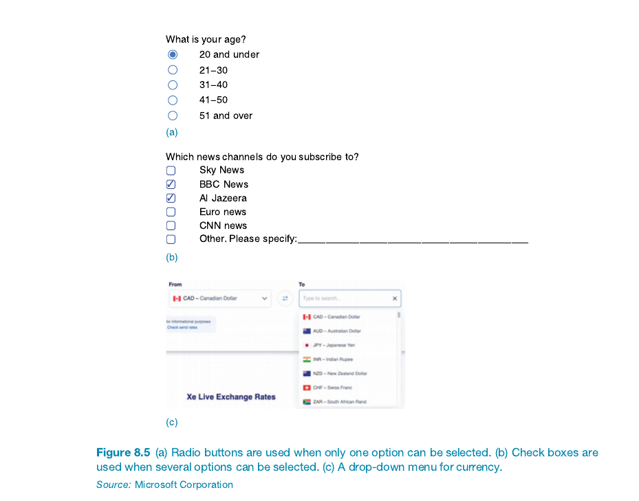
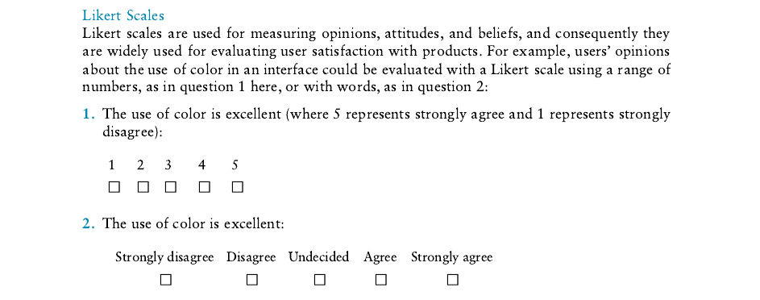
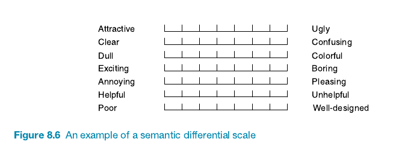
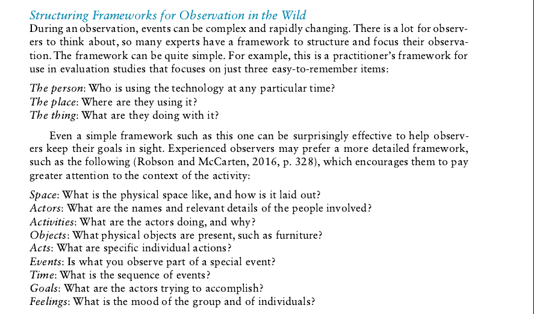
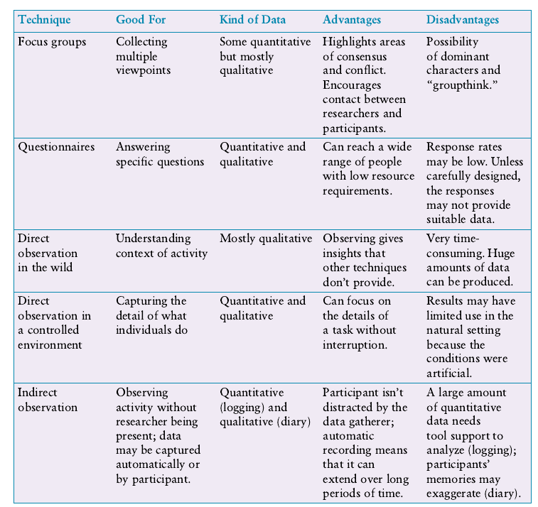
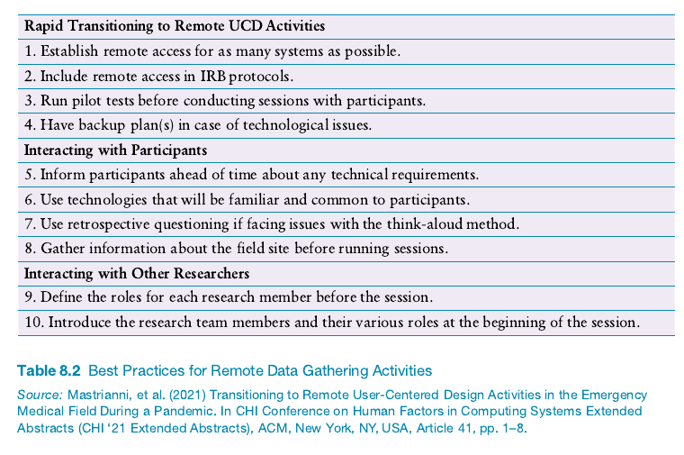

# C#hapter 8 - Data Gathering

### 8.1 Introduction

### 8.2 Six Key Issues
- #### 8.2.1 Goals
- #### 8.2.2 Identifying Participants
- #### 8.2.3 Relationships with participants
- #### 8.2.4 Ethics of data gathering and storage
- #### 8.2.5 Triangulation
- #### 8.2.6 Pilot Studies

### 8.3 Capturing Data
- #### 8.3.1 Notes Plus Photographs
- #### 8.3.2 Audio Plus Photographs
- #### 8.3.3 Video

### 8.4 Interviews
- #### 8.4.1 Unstructured Interviews
- #### 8.4.2 Structured Interviews
- #### 8.4.3 Semi-Structured Interviews
- #### 8.4.4 Focus Groups
- #### 8.4.5 Planning and Conducting an Interview
- #### 8.4.6 Doing Interviews Remotely
- #### 8.4.7 Enriching the Interview Experience

### 8.5 Questionnaires
- ### 8.5.1 Questionnaire Structure
- ### 8.5.2 Question and Response Format
- ### 8.5.3 Administering Questionnaires

### 8.6 Observation
- #### 8.6.1 Direct Observation in the Wild
- #### 8.6.2 Direct Observation in Controlled Environments
- #### 8.6.3 Indirect Observation: Tracking Users’ Activities

### 8.7 Putting the Techniques to Work
- #### 8.7.1 Choosing Techniques
- #### 8.7.2 Adapting Techniques for Different Participants
- #### 8.7.3 Gathering Data Remotely

---
### **8.1 Into**

Skipped 

###  Six Key Issues for Data Gathering**

#### 1. **Setting Goals 🎯**  
   - Define clear goals to guide the data gathering, analysis, and sessions. Goals can vary from measuring a user interface's effectiveness to understanding user reactions to new technology.  
   **Quotes & Attributions**:
   - **Robson and McCartan (2016)**: Emphasize that well-defined goals determine the techniques and analysis used.
   - **Ron Kohavi et al. (2020)**: Stress the complexity of combining metrics in online experiments like A/B testing.

#### 2. **Identifying Participants 👥**  
   - Choose participants based on study goals. Techniques include probability sampling (random selection) and nonprobability sampling (e.g., convenience sampling or volunteer panels).
   **Quotes & Attributions**:
   - **Vera Toepoel (2016)**: Details various sampling methods for surveys, emphasizing their impact on generalizability.

#### 3. **Relationship with Participants 🤝**  
   - Build a professional rapport and gain informed consent. The relationship affects data reliability. Consent can be oral, written, or recorded. Rapport is key for quality data collection, especially in remote settings.
   **Quotes & Attributions**:
   - **Peter Kaulbach et al. (2021)**: Emphasize the importance of respecting sociocultural norms, like meeting community leaders before data collection.
   - **Dray and Siegel (2004)**: Mention challenges in building rapport in remote data collection.

#### 4. **Ethical Considerations of Data Collection and Storage 🛡️**  
   - Ensure participants' data is secure and anonymous. Regulations like GDPR require careful data handling and protection, with potential legal consequences for mishandling.
   **Quotes & Attributions**:
   - **GDPR Guidelines**: Highlight the need for data encryption and secure storage to protect participants.

#### 5. **Triangulation 📐**  
   - Use multiple perspectives to ensure data accuracy. This can include different data sources, researchers, theories, or methodologies.
   **Quotes & Attributions**:
   - **Denzin (2006)** and **Jupp (2006)**: Define four types of triangulation, such as data triangulation and investigator triangulation, to improve data reliability.
   - **Nan Gao et al. (2021)**: Found that physiological data and self-reported engagement may not always match, questioning the reliability of ground truth.

#### 6. **Pilot Studies 🧪**  
   - Conduct a trial run of the study to identify and correct issues before the main data collection. It helps test procedures, equipment, and even research questions.
   **Quotes & Attributions**:
   - **Omid Mohaddesi and Casper Harteveld (2020)**: Piloted their study to verify if their game-based environment was suitable for future research.

---

### **8.3 Capturing Data **:
#### **8.3.1 Notes Plus Photographs 📒📸**:

- **Note-taking** (handwritten or typed) is a flexible, low-tech way to capture data, helping analysts focus and reflect 📝.
- **Handwritten Notes** are less intrusive than typing, and more adaptable for things like diagrams ✍️.
- **Benefits**: Writing by hand helps researchers concentrate on important points and begin analyzing early 🔍.
- **Challenges**: Difficult to capture everything accurately, tiring, prone to biases, and can be hard to read 🌀.
- **Photographs & Videos**: These visual aids help supplement notes with more context—like snapshots of artifacts, events, or environments 📷🎥.
- **Collaboration**: Working with a colleague helps capture more perspectives and reduces note-taking fatigue 🤝.

**Quotes & Attributions**:
- **Sharp et al. (2022)**: Describes the benefits and challenges of using handwritten notes for data gathering and the value of adding photographs and videos for richer context.

#### **8.3.2 Audio Plus Photographs 🎤📸**:

- **Audio Recording** is a helpful alternative to note-taking, less intrusive than video, and lets observers focus on the activity rather than jotting down everything 🗣️.
- **Interview Advantage**: Allows the interviewer to focus on the interviewee, improving the quality of the interaction 🤝.
- **Selective Transcription**: Usually, only important parts are transcribed based on study goals. Full transcription isn’t always necessary ✍️.
- **Memory Aid**: Recordings evoke vivid memories of the session, providing richer context during analysis 🧠.
- **Quality Matters**: Good audio quality is crucial—positioning the recording device well and avoiding loud noises is key 🎙️.
- **Tools & Tech**: Platforms like Zoom and Teams allow direct recording, sometimes with automated transcription, reducing the burden of manual transcription 💻📝.
- **Accuracy Issues**: Automated transcriptions are around 80-90% accurate, affected by noise and clarity of speech 🔊.
- **Visual Aid**: Audio recordings are often paired with photographs to provide more complete context 📷.

**Quotes & Attributions**:
- **Sharp et al. (2022)**: Highlighted the benefits of using audio recordings combined with photographs for enhancing the quality of data gathering and reducing the workload of note-taking.

#### **8.3.3 Video 🎥**:

- **Video Recording**: Smartphones can collect short video clips; ideal for capturing rich context quickly 📱.
- **Long-term Needs**: For long recordings (e.g., in labs or hospitals), dedicated cameras are often better for stability and coverage 🔄.
- **Camera Types**:
  - **Wearable Cameras**: Capture from a participant’s point of view, great for immersive experiences 🏃‍♂️👀.
  - **360-Degree Cameras**: Capture full context, providing a comprehensive overview of the activity 🌐.
- **Fixed vs. Flexible Settings**:
  - **Fixed Cameras**: Stay in one place, ideal for consistent angles 🗺️.
  - **Flexible Cameras**: Allow zooming and focusing; useful if researchers need control over the recording remotely or onsite 🔍.
- **Camera Placement**: Crucial for capturing relevant action. Plan in advance, and familiarize with the environment to find the best locations 🗺️📌.
- **Participant Involvement**: Involve participants in deciding what and where to record; especially important in private settings (e.g., home) 🏠🤝.
- **Impact on Participants**: Video might affect behavior; researchers should empirically assess whether recording influences actions (e.g., participants being camera-conscious) 📹👀.

**Quotes & Attributions**:
- **Nassauer and Legewie (2022); Heath et al. (2010)**: Discussed considerations for choosing cameras, placement, and settings, emphasizing the importance of understanding context and participant behavior during video recording.

---

### **8.4 Interviews 🎙️**:

#### **8.4.1 Unstructured Interviews 🎙️**:

- **Exploratory Approach**: Unstructured interviews are like conversations, providing open-ended exploration rather than strict question-answer sequences 🌊.
- **Freedom in Answers**: Questions are open, allowing interviewees to answer in detail or briefly, based on their comfort and insight 💬.
- **Interviewer’s Role**:
  - Uses **probes** to delve deeper (e.g., "Can you tell me more about...?") 🕵️‍♂️.
  - Needs a **plan** to ensure all important topics are covered but remains flexible to explore unexpected areas 📑.
- **Rich & Complex Data**: Generates detailed and interconnected information, offering deep insights into the topic 🧠✨.
- **Time-Consuming Analysis**: The open nature means interviews differ greatly between participants, leading to longer analysis times ⏳.
- **Unique Insights**: Often surfaces issues not initially considered by the interviewer, offering fresh perspectives 🌱.

**Quotes & Attributions**:
- **Grounded Theory & Other Analytic Approaches (Chapter 9)**: Techniques from grounded theory are used to identify themes across interviews and interpret the complex data produced in unstructured formats.

#### **8.4.2 Structured Interviews 📝**:

- **Predetermined Questions**: Interviewer asks **prewritten questions**, similar to a questionnaire format, to ensure consistency 📋.
- **Standardization**: The same questions are asked to every participant, making the study results **comparable and standardized** 📊.
- **Closed Questions**: Typically uses **closed questions**, with answers from a **set of alternatives** (e.g., multiple-choice or Yes/No) to gather focused data 🎯.
  - Examples: "Which app do you use most frequently: Prime Video, GoogleTV, or Netflix?" 📱.
- **Clear & Concise**: Questions are designed to be **short and clearly worded** for efficient communication 💬.
- **Specific Goals**: Best used when research goals are **well understood** and specific insights are targeted 🎯.
- **Consistent Wording & Order**: Questions are **asked in the same way and order** to all participants for consistency 🔁.

**Quotes & Attributions**:
- **Section 8.5**: For more information on designing questions for structured interviews, refer to the "Questionnaires" section to understand formatting techniques and consistency requirements.

#### **8.4.3 Semi-Structured Interviews 🎤📝**

- **Combination of Structured & Unstructured**: Uses a mix of **structured questions** (like in surveys) and **open-ended questions** to allow deeper exploration 🌐.
- **Basic Script for Guidance**: Interviewer follows a **basic script** to ensure all key topics are covered, while still leaving room for flexibility 🚦.
- **Preplanned Questions + Probing**: Starts with **prepared questions**, then **probes** for further details until no new information is provided 🔍.
  - Example: "Which music websites do you visit?" ➡️ Probing deeper into reasons and layout preferences 🎶.
- **Avoiding Bias**: Questions must be **neutral** and **non-leading** to avoid pre-empting answers, especially important with children 🤐🧒.
- **Body Language Matters**: Interviewer’s **body language** (e.g., smiling, scowling) can impact how the interviewee responds, hence should be neutral 🤷‍♀️.
- **Use of Probes**: Neutral probes like "**Do you want to tell me anything else?**" and **prompts** are used to gain more details without introducing bias 📌.

**Quotes & Attributions**:
- **Section 8.4.5**: For more techniques on avoiding biases in interviews, refer to the "Planning and Conducting an Interview" section, which provides deeper insights into effective interview practices.

#### **8.4.4 Focus Groups 💬👥**

- **Group Interviews**: Unlike one-on-one interviews, focus groups involve **3-10 people**, led by a **trained facilitator** 👨‍🏫👩‍🏫.
- **Participant Selection**: Participants are chosen to represent a **diverse sample** of the target population. For example, administrators, faculty, and students could form different focus groups for a campus map evaluation 🎓📍.
- **Benefits**:
  - **Diverse Viewpoints**: Great for capturing multiple perspectives and shared issues, which might be missed in individual interviews 🌍🔍.
  - **Flexibility**: The facilitator can follow **unexpected topics** as they come up while keeping a **preset agenda** 📋.
- **Facilitator Role**: Facilitator manages the discussion, **encourages quieter participants**, and **controls dominating voices** to ensure everyone is heard 🤐🔊.
- **Challenges**:
  - **Careful Facilitation Needed**: It can be easy to stray off-topic, requiring skillful moderation 🛑🗣️.
  - **Groupthink**: Risk of people agreeing with dominant voices instead of providing **individual insights** 🧠➡️🧠.
- **Examples**:
  - **Smart Home Study**: Abir Ghorayeb et al. (2021) held focus groups in a **smart home setting** to bring in real-world examples of technology use 🏠🤖.
  - **Kenyan "Talking Circle"**: Elizabeth Warrick et al. (2016) used a **traditional Kenyan talking circle** approach for focus groups to respect the cultural practices of elders speaking in turn 🌀🗣️.

**Quotes & Attributions**:
- **Nielsen (1997)**: Warned that focus groups should not be the sole source of information for understanding user behavior.
- **Unger and Chandler (2012)**: Highlighted that focus groups are effective for surfacing multiple user stories in collaborative processes.

#### **8.4.5 Planning and Conducting an Interview 📝🎤**

- **Interview Planning**:
  - Prepare **questions/topics** and collate **documentation** (e.g., consent forms) 🗂️.
  - Test **recording equipment** and schedule the interview time and place ⏱️🎥.
  - If in-person, bring **snacks and drinks** to create a relaxed atmosphere ☕🍪.

- **Guidelines for Developing Questions**:
  - **Short Questions**: Avoid long or compound questions; break them into simpler parts 🗣️➡️❓.
  - **Avoid Jargon**: Use **simple language** to ensure interviewees understand 🧠🔍.
  - **Keep Questions Neutral**: Don’t assume a particular answer; ask open-ended, unbiased questions ⚖️❔.

- **Interview Structure**:
  - **Introduction**: Introduce yourself and explain the purpose of the interview 👋🎯.
  - **Warm-Up**: Start with simple questions (e.g., demographic info) to make the interviewee comfortable 🌞.
  - **Main Session**: Ask the main questions, with more complex ones towards the end 🛤️.
  - **Cooling-Off**: Wrap up with easy questions to wind down ❄️.
  - **Closing**: Thank the interviewee and end any recordings ✨🙏.

- **Examples and Activities**:
  - **Goal Definition**: Understand the **appeal of devices** to young people aged 14-16 📚🧒👧.
  - **Suggested Questions**:
    - Why do you like using an ebook reader? 📖🤔
    - Have you used similar devices before? Yes/No ❓✅❌.
  - Use **audio recording** for less distraction, supplemented with photos for clarity 🎙️📸.

**Quotes & Attributions**:
- **Robson and McCartan (2016)**: Provided guidelines for planning interviews, emphasizing simplicity, neutrality, and good structure.

#### **8.4.6 Doing Interviews Remotely 💻📞**

- **Advantages of Remote Interviews**:
  - Participants are in **familiar environments** and feel more relaxed 🏠😌.
  - No need to **travel** or worry about health and safety 🚗🛡️.
  - Less concern about **appearance** since they're at home 👕🎽.
  - **Sensitive topics** can be easier to discuss, especially with audio-only calls 🎙️🙊.
  - Participants have the freedom to **leave anytime** if they feel uncomfortable 🚪👋.

- **Disadvantages of Remote Interviews**:
  - Lack of visibility for **body language**, making it harder to gauge responses 🤷‍♂️👀.
  - Participants may be more tempted to **multitask** instead of focusing 🖥️📱.

- **Tips for Conducting Remote Interviews**:
  - **Technology Check**: Ensure participants have the right equipment and knowledge for video/audio calls 💻🔧.
  - **Building Rapport**: Making a connection can be harder remotely, especially if participants don't know you beforehand 🤝💬.
  - **Environmental Challenges**: Beware of **distractions** or other people appearing in the background, which could breach data protection ⚠️🚪.

- **Remote Focus Group Challenges**:
  - Manage participation with several people effectively 👥🗣️.
  - Combine tools like **Zoom** or **Teams** with collaborative activities like **brainstorming** or **mindmapping** using tools like **Miro**, **Mural**, or **Jamboard** 🧠📊.

**Quotes & Attributions**:
- **UX Booth**: Discusses remote user interview techniques, emphasizing the importance of building rapport and managing technology challenges effectively.

#### **8.4.7 Enriching the Interview Experience 🎨💬**

- **Using Artifacts as Props**:
  - Using **personas**, **prototypes**, or **scenarios** helps make the discussion more tangible and relatable 🖼️👥.
  - Props provide a **contextual focus** for participants, grounding their responses in practical examples 🛠️.

- **Virtual Prototypes for Remote Interviews**:
  - **Almohannad Albastaki et al. (2020)** used a virtual prototype to explore robotic expressions in an urban setting 🌌🤖.
  - Participants were asked to navigate a **virtual alleyway at night** while using "think-aloud" methods 🌃🗣️.
  - Results showed that **virtual prototypes** can achieve **ecological validity**, meaning they provide realistic results comparable to physical settings 🧪✅.
  - Videoconferencing to record sessions helped minimize the **equipment needed** for capturing data, making the process more efficient 🎥💻.

**Quotes & Attributions**:
- **Almohannad Albastaki et al. (2020)**: Explored the effectiveness of virtual experience prototypes, concluding that they offer valid insights and reduced equipment requirements for remote evaluations.

---

### **8.5 Questionnaires 🎙️**:

#### **8.5.1 Questionnaire Structure 📝📊**

- **Start with Demographic Info**:
  - Gather details like **gender, age, and experience** to give context to responses 🎯👥.
  - Relevant background can explain different perspectives (e.g., novice vs. experienced users) 🔄.

- **Organizing Questions**:
  - Begin with demographic questions, then move to questions about the study's goals 🗂️➡️.
  - Related topics should be grouped together for **logical flow** 🧩.

- **Questionnaire Design Tips**:
  - Order of questions matters—**previous questions can influence responses** to following ones 🔄.
  - Tailor versions for **different populations** if necessary 👥📝.
  - Provide **clear instructions** on how to answer and complete the questionnaire ✅✍️.
  - Avoid unnecessary questions to keep it **concise and focused** ✂️.
  - For long questionnaires, allow respondents to **opt out** in stages to reduce dropout 📉🚪.
  - Balance **layout and pacing** with effective use of space—compact but not overwhelming 📏.

**Quotes & Attributions**:
- **General Advice**: Clear instructions, logical flow, and effective pacing are key to successful questionnaires.

#### **8.5.2 Question and Response Format 📝🔍**

- **Closed-Ended Questions**:
  - Use predetermined answers (e.g., multiple choice, “none of these”) for easy analysis and response clarity 🗂️✔️.
  - Include "no opinion" or “other” options where applicable to keep responses unbiased 🚫🤔.

- **Ranges and Predefined Lists**:
  - Use ranges for predictable responses like age or nationality 🌍🔢.
  - Be careful of overlapping ranges—e.g., **15-19** and **20-24** to avoid confusion 🔄.
  - Ranges don't always need to be equal; tailor them to the study goals (e.g., younger adults or generational analysis) 🎯.

- **Rating Scales**:
  - **Likert Scale**: Used to measure opinions with statements like "Strongly Agree to Strongly Disagree" 👍👎.
  - **Semantic Differential Scale**: Measures bipolar attitudes using pairs like "Attractive vs. Ugly" 😍🤢.
  - The number of points on a scale can vary (e.g., 3, 5, 7, or more), depending on how fine the discrimination needs to be. Odd numbers allow a central "neutral" point, while even forces a decision 🗳️.

- **Tips on Designing Rating Scales**:
  - Choose the scale length based on how nuanced you need the responses to be (e.g., **3-point for simple**, **7-point for judgments**, **longer for subtle differences**) 📏.
  - **James Lewis and Oğuzhan Erdinç (2017)** found no major differences in reliability between 7-point, 11-point, or 101-point scales. Use the scale that fits your need best without overwhelming respondents 🎚️.

**Quotes & Attributions**:
- **James Lewis & Oğuzhan Erdinç (2017)**: Found no difference in reliability, validity, and sensitivity between 7-point, 11-point, and 101-point scales.

### **8.5.3 Administering Questionnaires 📋📊**

- **Participant Sampling**:
  - Small samples (less than 20) often achieve full response rates 📈.
  - Larger surveys may require sampling techniques to reach a broader audience 🌐.

- **Questionnaire Formats**:
  - **Paper Questionnaires**: Still useful in specific contexts, e.g., public places 📝.
  - **Online Questionnaires**: Most popular; allow interactive features like checkboxes, drop-down menus, and automatic data validation 💻✔️.

- **Response Rates & Incentives**:
  - High return rates (~40%) are often seen as acceptable; incentives may be needed for larger samples to ensure engagement 🎁.

- **Designing & Deploying Online Questionnaires**:
  1. **Plan Timeline**: Work backward from the deadline to ensure all steps are completed on time ⏳📅.
  2. **Offline Design**: Create in plain text for easy transfer to online tools ✍️➡️🖥️.
  3. **Program the Survey**: Complexity affects the time needed (e.g., multiple paths or interactions) 🤖.
  4. **Test the Survey**: Ensure proper behavior and get feedback from content experts and potential respondents 🧪👥.
  5. **Recruit Respondents**: Make invitations appealing, simple, and respectful to encourage participation 📢✨.

- **Segmentation**:
  - Allows respondents to skip irrelevant questions, reducing frustration and increasing data quality ✂️❓.
  
**Quotes & Attributions**:
- **Toepoel (2016)**: Emphasizes the value of properly planning, designing, and testing surveys to ensure quality responses.

---

### **8.6 Observation 👀📊**

- **Purpose of Observation**:
  - Useful throughout product development: early on to understand user context and later to evaluate prototypes ⚙️📝.
  
- **Types of Observation**:
  - **Direct Observation**: Watching users perform activities in real-time 👥.
  - **Indirect Observation**: Reviewing records of activities afterward 📄.

- **Settings for Observation**:
  - **In the Wild**: Observing people in their natural environment to see genuine behaviors and context 🌍🏞️.
  - **Controlled Environment**: Conducting observations in a lab to control variables and capture detailed interactions 🧪🏢.

- **Scenario Comparisons**:
  - **In the Wild**:
    - 👍 **Advantages**: Real-life context; provides insight into natural user behaviors and practical challenges.
    - 👎 **Disadvantages**: Subjectivity from observer involvement; qualitative data that’s hard to replicate.
  - **Controlled Environment**:
    - 👍 **Advantages**: Replicable; can identify specific usability issues and compare multiple participants’ performance.
    - 👎 **Disadvantages**: Artificial setting may not reflect real-world usage accurately 🌐⚠️.

- **Use Cases**:
  - **Lab Studies**: Ideal for detailed usability testing to find interface issues 🔍.
  - **In the Wild**: Best for understanding how a product fits into users’ daily lives and impacts their behavior 🚶‍♂️📱.

**Quotes & Attributions**:
- **Kjeldskov and Skov (2014)**: Emphasized that deciding between wild or lab studies depends on the research goals, and both have merits. They suggest considering long-term in-the-wild studies for more comprehensive insights.

#### **8.6.1 Direct Observation in the Wild 🕵️‍♂️🌍**

- **Why Observation in the Wild?**:
  - Helps capture *real behaviors* and nuances not easily explained in interviews or questionnaires 🗣️📋.
  - Shows how people use technology in natural settings, providing richer context 🖼️✨.

- **Challenges**:
  - Gathering lots of data that can be *tedious to analyze* and not always relevant 🌀📊.
  - Requires a clear goal but flexibility to adapt if unexpected situations arise 🎯🔄.

- **Simple Framework for Observation**:
  - **The Person**: Who is using the tech? 👤
  - **The Place**: Where are they using it? 🏠
  - **The Thing**: What are they doing with it? 📱

- **Detailed Framework for In-Depth Observation (Robson & McCarten, 2016)**:
  - **Space**: Physical environment and layout 📏
  - **Actors**: People involved and their details 👥
  - **Activities**: What they are doing and why 🎬
  - **Objects**: What physical objects are around? 🛋️
  - **Acts**: Specific actions taken 📌
  - **Events**: Is this part of a special event? 🎉
  - **Time**: Sequence of actions ⏳
  - **Goals**: What are they trying to achieve? 🏆
  - **Feelings**: Mood of individuals or group 😊😠

- **Degree of Participation**:
  - **Passive Observer**: Watches without intervening, suitable for lab studies 🧑‍💻.
  - **Participant Observer**: Becomes part of the group, balancing between participation and observation 🤝.

- **Benefits of Team Observation**:
  - **Coverage**: Each observer focuses on different aspects, covering more ground 🗺️.
  - **Reliability**: More observers mean more reliable data and diverse perspectives 🔍👥.
  - **Reflection**: Easier to interweave observation and reflection 🔄.

**Quotes & Attributions**:
- **Robson & McCarten (2016)**: Emphasized the importance of structured frameworks for observation to maintain focus, while also allowing the observer to adapt as new insights emerge.

#### 8.6.2 Direct Observation in Controlled Environments 🧪👀

- **Formal Settings**: Controlled observations often take place in usability labs with a prepared script to maintain consistency among participants. 📋
- **Data Collection Tools**: Techniques like taking notes, photos, audio, and video are used to capture participant behavior, with a focus on detailed individual actions rather than environmental context. 🎥✍️
- **Multi-Camera Setup**: Cameras may record different perspectives—face, body language, and interface activity—allowing for a comprehensive understanding of user interactions. 📸👤💻
- **Think-Aloud Technique**: Participants verbalize their thoughts during tasks to help observers understand their cognitive processes. This technique is crucial in identifying users' challenges but often leads to awkward pauses or silence. 🗣️🤔
- **Constructive Interaction**: To avoid awkward silences, having participants work together and talk to each other during the task can produce more natural and insightful data, especially for children. 👥🤝

**Quotes & Attributions**:
- **Anders Ericsson and Herbert Simon (1984)**: Developed the think-aloud technique for examining problem-solving strategies.
- **Miyake (1986)**: Introduced constructive interaction as a less intrusive alternative to think-aloud protocols.
- **Clemmensen et al. (2008)**: Highlighted cultural influences on verbalization during think-aloud sessions.

Here’s a summarized version with emojis for the given section:

#### 8.6.3 Indirect Observation: Tracking Users’ Activities 📊👀

- **When Direct Observation Isn’t Possible**: Use diaries and interaction logs to collect data when direct observation is not feasible or would be too intrusive. 📚💻
- **Diaries as Data Collection**:
  - **Participant Records**: Participants keep track of what they do, how they feel, and the challenges they face. 📖✍️
  - **Real Life Example**: Junchao Lin et al. (2020) conducted a 30-day diary study on couples sharing digital accounts, finding both the benefits of shared routines and the drawbacks of unintended information sharing. ❤️🔐
  - **Self-Care Study**: Caroline Claisse et al. (2022) used paper diaries to study self-care practices of adults living with HIV, highlighting how diary routines became part of care practices. 📝✨
  - **Challenges**: Diaries can be unreliable if participants forget or lose motivation; incentives and reminders may be needed. 🎁⏰
- **Experience Sampling Method (ESM)**:
  - **Prompting Participants**: Unlike traditional diaries, ESM prompts participants at random times for immediate feedback (e.g., Mintra Ruensuk et al. (2022) used ESM to understand Instagram users’ emotions). 📲😊😟
- **Interaction Logs**:
  - **Activity Tracking**: Interaction logging software captures data like key presses, mouse movements, and session times—allowing deep quantitative analysis. 🖱️📈
- **Web Analytics & Data Scraping**:
  - **Online Behavior Insights**: Analyzing online trails, such as Twitter discussions, provides insights into public reactions, although ethical concerns about privacy can arise. 🌐🔍

**Quotes & Attributions**:
- **Junchao Lin et al. (2020)**: Conducted a diary study on couples sharing digital accounts, highlighting both the benefits and drawbacks of shared digital spaces.
- **Caroline Claisse et al. (2022)**: Explored self-care through diaries with adults living with HIV, emphasizing the role of mundane practices in empowering patient care.
- **Mintra Ruensuk et al. (2022)**: Used ESM to capture emotional states of Instagram users immediately after app use.

---

### 8.7 Putting the Techniques to Work 

#### 8.7.1 Choosing Techniques 🛠️🔍

- **Choosing Techniques Depends on Study Goals**:
  - Different techniques gather different types of data—quantitative, qualitative, or a mix. 📊📋
  - The chosen technique should fit the study goals, participants, available resources, and whether data collection will be remote or face-to-face. 🌐👥
  
- **Overview of Data Gathering Techniques**:
  - **Interviews**:
    - Best for exploring issues in depth.
    - Mostly qualitative, some quantitative.
    - Direct contact helps understand participants, but it can be intimidating in artificial settings. 👥💬
  
  - **Focus Groups**:
    - Useful for gathering multiple viewpoints.
    - Mainly qualitative data.
    - Encourages discussion but may suffer from “groupthink” or dominant voices. 🗣️🤝
  
  - **Questionnaires**:
    - Good for answering specific questions with fewer resources.
    - Collects both quantitative and qualitative data.
    - Can reach many people, but response rates might be low. 📄🖊️
  
  - **Direct Observation in the Wild**:
    - Understands the natural context of activities.
    - Mostly qualitative.
    - Provides deep insights but requires time and results in large volumes of data. 🌿👀
  
  - **Direct Observation in Controlled Environments**:
    - Captures task details in a structured setting.
    - Both quantitative and qualitative data.
    - Results may be less applicable to real-world scenarios due to artificial conditions. 🧪📹
  
  - **Indirect Observation**:
    - Involves logs or diaries.
    - Mix of qualitative (diary) and quantitative (logging) data.
    - Less intrusive, but logs require tool support, and diary entries can be biased. 📈📖

**Quotes & Attributions**:
- **Robert Yin (2018)**: Emphasized that case studies are best for answering "how" and "why" questions, integrating multiple perspectives, and analyzing events in context.
- **Jonathan Lazar et al. (2017)**: Identified four reasons for using case studies in HCI: exploration, explanation, description, and demonstration.

#### 8.7.2 Adapting Techniques for Different Participants 🛠️👥

- **Adapting Data Gathering Techniques**:
  - Techniques must be adjusted to suit the participants' needs and study context. 🧩👥

- **Child-Friendly Methods**:
  - Children react differently than adults; visual aids like visual Likert scales help make things easier. 📊🖍️
  - **Cynthia Putnam et al. (2020)** used visual Likert scales for 7-11-year-olds to make data gathering more accessible.

- **Involving Caregivers**:
  - For participants with intellectual disabilities, caregivers helped make abstract questions concrete and relatable. 🗣️❤️
  - **Laurianne Sitbon & Shanjana Farhin (2017)** adapted their questions by involving familiar examples and caregiver assistance.

- **Animal-Computer Interaction**:
  - Studying animal interaction with technology requires adapting human-centered methods to interpret animal behaviors. 🐶🔍
  - **Luisa Ruge & Clara Mancini (2019)** reinterpreted usability evaluation principles for mobility assistance dogs to understand animal interaction.

- **Wearable Devices for Animals**:
  - Wearable devices need careful design to avoid interfering with the natural behaviors of animals. 🐾📡
  - **Patrizia Paci et al. (2017)** studied the wearability of GPS trackers on cats to ensure they didn't cause harm or discomfort.

**Quotes & Attributions**:
- **Cynthia Putnam et al. (2020)**: Created a visual Likert scale for children aged 7-11 to ease data gathering.
- **Laurianne Sitbon & Shanjana Farhin (2017)**: Emphasized the role of caregivers in adapting questions for participants with intellectual disabilities.
- **Luisa Ruge & Clara Mancini (2019)**: Adapted usability evaluation methods for animals in the context of Animal-Computer Interaction.
- **Patrizia Paci et al. (2017)**: Developed methods to assess wearable GPS trackers on cats, ensuring no negative impact on their welfare.

#### 8.7.3 Gathering Data Remotely 🌐📊

- **Access to Diverse Participants**:
  - Remote data gathering allows researchers to reach participants from different countries, age groups, or with different abilities. 🌍👥

- **Adaptations for Remote Studies**:
  - During COVID-19, many studies moved to remote data gathering, requiring adjustments like indirect observation through video recordings rather than direct real-time observation. 📹💡

- **Best Practices for Remote UCD Activities**:
  - **Angela Mastrianni et al. (2021)** shared their best practices for remote user-centered design in the emergency medical field, suggesting:
    1. **Remote Access**: Establish access to as many systems as possible and include this in protocols. 🔒💻
    2. **Pilot Tests**: Conduct pilot tests before real sessions to avoid issues. 🚧✅
    3. **Backup Plans**: Have backup plans for potential technological failures. 📟🔄
    4. **Participant Interaction**: Inform participants about technical requirements and use familiar technologies. 🗣️⚙️
    5. **Researcher Roles**: Define roles within the research team clearly and introduce each member during the session. 👫👥

**Quotes & Attributions**:
- **Angela Mastrianni et al. (2021)**: Shared insights on transitioning to remote user-centered design activities, including best practices for interacting with participants and managing technical issues effectively.

---

### Summary of Chapter 8: Data Gathering 📊📝

- **Key Issues in Data Gathering**:
  - Goals, participant identification, relationship management, data storage, triangulation, and pilot studies. 🎯👥📦

- **Planning & Execution**:
  - Main techniques: **Interviews**, **Questionnaires**, **Observation**. Planning and capturing data was a critical part of the discussion. 📋🔍

- **Key Points**:
  - **Clear Goals**: All data gathering needs specific, well-defined goals. 🎯
  - **Permissions**: Informed consent and permissions may be required based on study context. 📝✔️
  - **Data Confidentiality**: Plan data storage carefully to protect participant confidentiality. 🔐
  - **Pilot Studies**: Use pilot studies to test the feasibility of the data gathering instruments and approach. 🚀📝
  - **Triangulation**: Investigate phenomena from different perspectives for more reliable results. 🔍🔄
  - **Data Recording Methods**: Handwritten notes, audio/video recordings, and photographs. ✏️🎥📸
  - **Types of Interviews**: Structured, semi-structured, unstructured. 🗣️
  - **Questionnaires**: Can be online, email, or paper-based, with open or closed-ended questions. 📮💻📝
  - **Observation Styles**: Direct vs. indirect observation; the observer can be a participant or passive. 👀👤
  - **Technique Selection**: Choose methods based on study goals, participant types, technique specifics, and resource availability. 🎯🔧💡
  - **Remote Data Gathering**: Useful for accessing diverse participants and can be adapted to different contexts. 🌐💻
  - **Combining Techniques**: Often, multiple data gathering techniques are used together for thorough results. 🔄🔗

**Quotes & Attributions**:
- **Chapter Summary**: Highlights key aspects of gathering data, including goals, methods, recording techniques, and managing participant relationships.

---

### **Glossary for Chapter 8: Data Gathering**

**1. Data Gathering** 📊  
The process of collecting information to achieve specific research goals. It includes methods like interviews, questionnaires, and observation.

**2. Goal Setting** 🎯  
Defining clear objectives for data collection that guide what data is gathered and how it will be used.

**3. Identifying Participants** 👥  
The process of selecting individuals who will provide data for the study, often chosen based on research goals and target demographics.

**4. Relationship with Participants** 🤝  
Building a professional rapport and ensuring participants understand their role, rights, and how their data will be used during the study.

**5. Informed Consent** 📝  
Permission obtained from participants after explaining the study's purpose, procedures, and their rights, ensuring ethical participation.

**6. Triangulation** 📐  
Using multiple data sources, researchers, or methods to validate findings and increase reliability.

**7. Pilot Studies** 🧪  
Trial runs of the study conducted to test and refine data collection methods, instruments, and overall feasibility.

**8. Direct Observation** 👀  
Collecting data by watching participants in their natural setting or in a controlled environment to understand their behaviors.

**9. Observation in the Wild** 🌍  
A type of direct observation conducted in a participant's natural environment to gather real-life context and behaviors.

**10. Controlled Environment Observation** 🧪  
Observation performed in a structured, lab-like setting where variables can be controlled, allowing for focused insights on specific tasks.

**11. Indirect Observation** 🔍  
Gathering data through methods like diaries or logs, where researchers are not directly observing participants in real-time.

**12. Think-Aloud Technique** 🗣️  
A method used during observation where participants verbalize their thought process, allowing researchers to understand their reasoning and decision-making.

**13. Constructive Interaction** 👥💬  
An observation technique where participants work together, discussing their actions, providing a more natural flow of interaction data.

**14. Structured Interviews** 📝  
Interviews with predetermined questions that are consistently asked to every participant to gather comparable data.

**15. Unstructured Interviews** 🌊  
Free-form interviews where questions are more open-ended, allowing participants to guide the conversation and provide deeper insights.

**16. Semi-Structured Interviews** 🎤📝  
Interviews combining structured questions with open-ended prompts to explore topics more flexibly.

**17. Focus Groups** 💬👥  
Group discussions led by a facilitator to gather multiple perspectives and explore consensus or conflict on specific topics.

**18. Questionnaire** 📋  
A data gathering tool used to collect information from participants, typically consisting of structured questions that can be administered online, on paper, or via email.

**19. Likert Scale** 👍👎  
A rating scale used to measure attitudes or opinions, often ranging from 'strongly agree' to 'strongly disagree.'

**20. Semantic Differential Scale** 😊🤢  
A scale used to measure attitudes by asking participants to choose between two opposite adjectives (e.g., 'attractive' vs. 'ugly').

**21. Experience Sampling Method (ESM)** 📲  
A technique where participants are prompted at random times to provide immediate data on their experiences or feelings.

**22. Remote Data Gathering** 🌐📊  
Collecting data from participants who are not physically present, often using online tools or video conferencing, allowing for a broader participant base.

**23. Wearable Technology in Studies** 📡🐾  
Using wearable devices, like GPS trackers, to collect data on user behavior, commonly applied in studies involving animals or human health monitoring.

**24. Ethical Considerations** 🛡️  
Ensuring participants' privacy, confidentiality, and informed consent during the data collection process, following regulations like GDPR.

**25. Data Storage** 🔒  
The methods used to securely store participants' information, maintaining confidentiality and complying with legal requirements.

